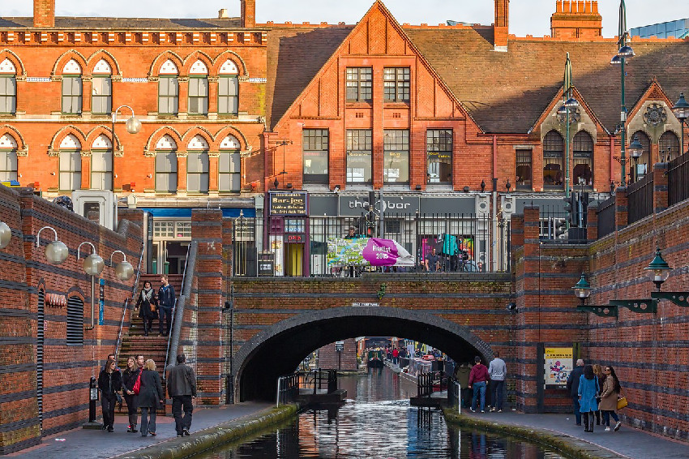

+++
title = "The Development of Parity - Business Credit Network for the West Midlands"
description = ""
date = "2018-02-28"
categories = ["Business Development","Company News"]
tags = []
author = "Stuart Bowles"
+++

## The Development of Parity - Business Credit Network for the West Midlands

## West Midlands Business Credit Network

Parity has evolved from a two year project researching a <a href="https://brumpound.wordpress.com/" style="color: #000000;">local currency for Birmingham</a>, modelled on the <a href="https://bristolpound.org/" style="color: #000000;">Bristol Pound</a>. The project provided the basis of a working group to explore the potential for an alternative currency in Birmingham. Research conducted included engaging with other local currency models in UK and European markets, allowing the project to fully understand the benefits and limitations for the initiatives. There has been a series of developments in the space over the past decade, with around thirty local city pounds developing in the UK. One of these initiatives; the <a href="https://www.colu.com/community/liverpool" style="color: #000000;">Liverpool Pound</a>, has been set up by the Israeli technology company; <a href="https://www.colu.com/" style="color: #000000;">Colu</a>, that has venture capital attempt to create a revenue generating model. The Birmingham Pound project identified that the models being pursued used a transaction fee of 1.5% to support the wider currency system. Business modelling established that the Birmingham Pound would need around £10.4million worth of annual transactions within its currently, to sustain a non-profit company to run its infrastructure. Although this may be achieved if users could pay their <a href="https://www.birmingham.gov.uk/" style="color: #000000;">Birmingham City Council</a> tax in the system, we believed it was difficult to stack up the figures.
A further outcome of the research was to consider a wider set of alternative currency systems that could sustain an alternative market within Birmingham. A cryptocurrency-based system in the City of Hull termed <a href="http://www.hull-coin.org/" style="color: #000000;">Hullcoin</a> and a mutual credit system based in Sardinia, Italy termed <a href="https://www.sardex.net/?lang=en" style="color: #000000;">Sardex</a>, were considered. Hullcoin have a great ambition to provide an alternative system of currency to support socially beneficial behaviour, we are watching them closely. Sardex provides a platform that allows companies to issue credit within an complementary currency to facilitate the trade of goods and services. It is a pivot on the model of the <a href="https://www.wir.ch/" style="color: #215aa5;">WIR Bank</a> (Switzerland) that was created in the 1930s, has 62,000 members and sustains over €1 billion of transactions in its complementary currency each year. Sardex was set up in 2008 to use the concept of a complementary currency to address liquidity issues on the island of Sardinia. 
After engaging with a series of stakeholders in the West Midlands, we have decided to set up a project that will develop a Sardex-style platform in the region. Although it is early days, we are shaping it to meet the specific regional needs of Small and Medium Enterprises (SMEs) and adapting the model for the West Midlands. We believe that there are a series of issues that need addressing and we are applying our unique skills and experience to address these. There is a critical need for business credit, business loans and business finance for SMEs in Birmingham and the West Midlands. There are already social-lenders including <a href="http://artbusinessloans.co.uk/" style="color: #000000;">ART Business Loans</a>, <a href="https://www.unity.co.uk/" style="color: #000000;">Unity Trust Bank</a> and <a href="https://bcrs.org.uk/" style="color: #000000;">BCRS Business Loans</a> who do a fantastic job supporting SMEs in the West Midlands. However, we at Parity believe there is an opportunity to offer a complementary solution that we will offer alongside these vital local services. We hope we can support the growth in business finance, to get more customers and find more regional suppliers. We will be updating you on our progress on this <a href="https://new.parity.uk/posts/" style="color: #000000;">Company News</a> page over the coming months. We hope you can join us in our development journey.
