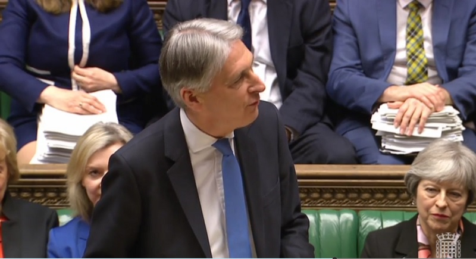

+++
title = "Chancellor announces measures to address late payments for UK SMEs"
description = ""
date = "2018-03-15"
categories = ["Regional News"]
tags = []
author = "Stuart Bowles"
+++

## Chancellor announces measures to address late payments for UK SMEs

Small businesses are the engine of the UK economy, making up over 90% of all businesses and employing over 60% of all private sector employees. However, small businesses have been often under served by different governments over the past four decades, with politicians focusing on supporting larger businesses. The banking crisis shook confidence in the large banks and a succession of corporate scandals have undermined the wider sectors. West Midlands small business were especially affected by the recent fallout of Carillion, as many of its small business suppliers and small business supply chains, were in the region.  These businesses may be owed money by Carillion that could affect repayments on business loans West Midlands and business loans Birmingham. The <a href="https://www.wmca.org.uk/news/west-midlands-combined-authority-joins-carillion-support-task-force/" style="color: #000000;">West Midlands Combined Authority</a> have set up a task force to support West Midlands small business. The future of the UK's prosperity is based on small businesses, who are often most innovative and have higher levels of growth.
SMEs struggle to obtain small business finance, small business loans and small business credit services, which is a major hindrance to meeting their aspirations for growth. Alongside small business access to finance and SME financing issues, SMEs are also affected by late payments by their customers. Public sector organisations like <a href="https://www.birmingham.gov.uk/" style="color: #000000;">Birmingham City Council</a>, <a href="http://www.wolverhampton.gov.uk/" style="color: #000000;">Wolverhampton City Council</a>, <a href="https://www.coventry.gov.uk/" style="color: #000000;">Coventry City Council</a> and <a href="http://www.solihull.gov.uk/" style="color: #000000;">Solihull Metropolitan Borough Council</a>, are sometimes responsible for late payments to small businesses. Private sector companies and corporations are also responsible for late payments to small businesses. Late payments could affect business credit, resulting in small business poor credit and SME poor credit. Poor credit business loans UK are very difficult to access and could result in small businesses ceasing trading. Decisions on business loans West Midlands and business loans Birmingham are often affected by a business poor credit score caused by SME late payments. If West Midlands small business are unable to access traditional finance, they are often supported by <a href="https://bcrs.org.uk/" style="color: #000000;">BCRS Business Loans</a> and <a href="http://artbusinessloans.co.uk/" style="color: #000000;">ART Business Loans</a>. Some businesses can sometimes access Birmingham small business grants and West Midlands small business grants.
The <a href="https://www.fsb.org.uk/" style="color: #000000;">Federation of Small Business</a> conducted research that found 84% of small businesses have experienced late payments and that around 25% of all SME contracts are paid late. It welcomed the recent reductions in deficit spending by the UK and called on the Chancellor to do more about SME late payments. The FSB were especially worried about late payments from large corporations. FSB National Chairman Mike Cherry stated; “Small firms will applaud healthy public finances off the back of responsible management. However, what they need to see day to day is large corporations taking a similarly responsible approach to paying suppliers. Small firms currently have billions withheld from them by large companies that pay late.” The Chancellor announced a consultation process that will consider the issue of late payments by corporations and what can be done to tackle the late payments culture.
The Parity Network is currently developing an innovative lending platform that will allow West Midlands to access interest free credit. Parity has considered SME calls for interest free business loans and 0% business loans to help support West Midlands small business and Birmingham small business. The credit available in Parity will not be interest free business loans, but it will be an additional source of liquidity. It will allow the purchase of goods and services from regional suppliers. The system may support businesses who are struggling with late payments, as it will provide a source of liquidity to meet day-to-day business needs whilst SMEs are awaiting payment. Parity hopes to launch its platform early next year, stay informed by following our <a href="https://new.parity.uk/posts/" style="color: #000000;">Company Updates</a>.
