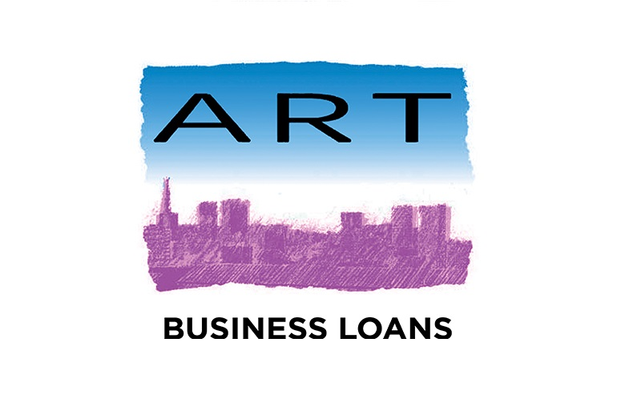

+++
title = "ART Business Loans - Annual General Meeting"
description = ""
date = "2018-10-02"
categories = ["Regional News"]
tags = []
author = "Stuart Bowles"
social_image = "ART-Logo.jpg"
social_image_alt_text = "ART Logo"
+++

## ART Business Loans - Annual General Meeting

Parity Network was honoured to be invited along to the [ART Business Loans](http://artbusinessloans.co.uk/) AGM on Friday 28th September. The event was hosted at the newish iCentrum building on [Innovation Birmingham Campus](https://www.innovationbham.com/). The event is held every year and brings together members and wider stakeholders of ART Business Loans. The organisation, originally called Aston Reinvestment Trust, is a cooperative that was formed in 1997 with the explicit aim to address the funding gap experienced by small companies in the West Midlands. The organisation was the first in the country to apply a model called the [Community Development Finance Institution](http://responsiblefinance.org.uk/), something that had been successful in the United States. The main focus of ART today is offering small business loans Birmingham and small business loans West Midlands.

The event was opened by the Chair of ART Business Loans Dr Nick Venning, who outlined the proceedings for the day. [Dr Steve Walker](http://artbusinessloans.co.uk/dr-steve-walker-is-named-responsible-finance-leader-of-the-year/), the CEO of ART Business Loans then discussed the successes of the organisation over the past year. He gave a range of figures that illustrated the impact that the organisation was having on the region. He outlined the story of a community fish and chip shop that had received support ART and was now thriving. The final speaker was Ed Mayo from [Cooperatives UK](https://www.uk.coop/), who gave an inspirational speech about the role cooperatives have in local community development. Unknown to me, ART Business Loans was actually a cooperative and was hoping to expand to raise its impact in the region. The speeches were well received by the audience that included representatives from [Unity Trust Bank](https://www.unity.co.uk/), [Natwest](https://www.business.natwest.com/) and the [University of Birmingham](https://www.birmingham.ac.uk/index.aspx).

The event was followed by networking that allowed me to engage a range of individuals on what Parity is hoping to achieve. Their was recognition of our approach, where we would offer complementary credit through our network that small businesses can use alongside the traditional sources of funding. This approach has been shown to be very effective in Italy and in Switzerland, which we believe should be replicated here in the West Midlands. ART Business Loans was originally a replication of a great idea from the United States, which has thrived over the last 21 years. Parity hopes to be the next replication success story in the West Midlands, which will only be good for small business access to finance.
