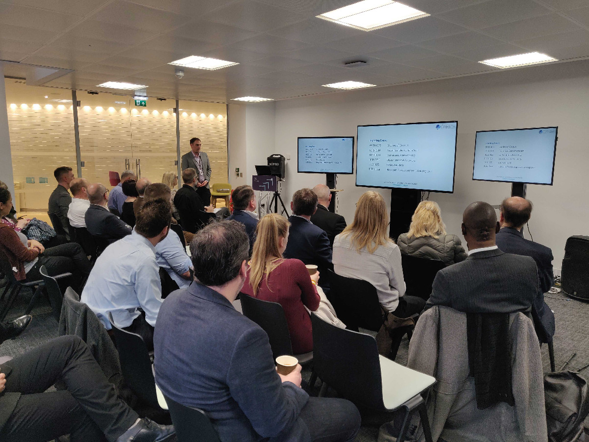
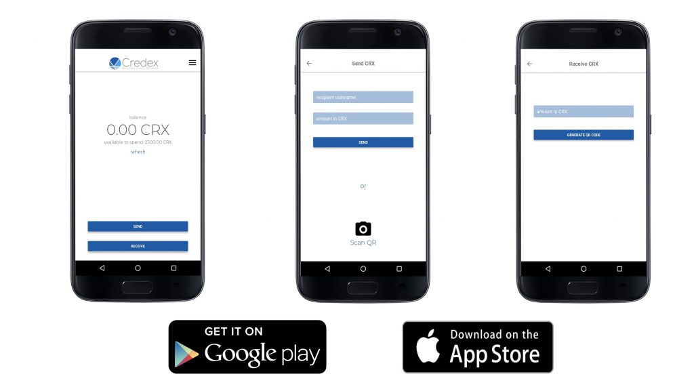
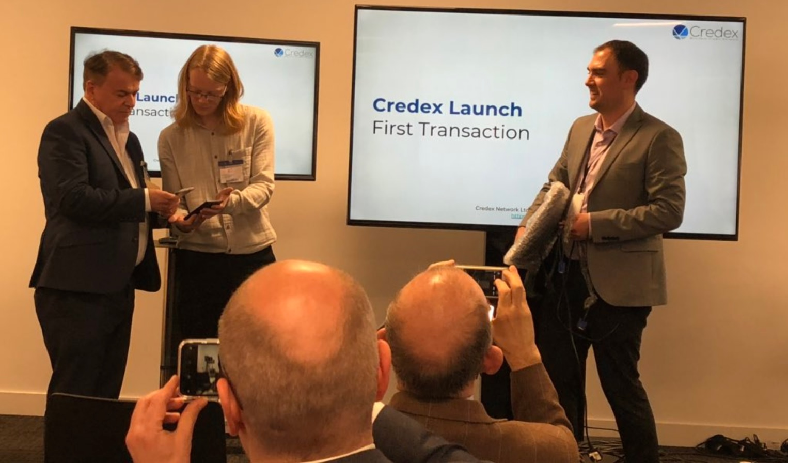
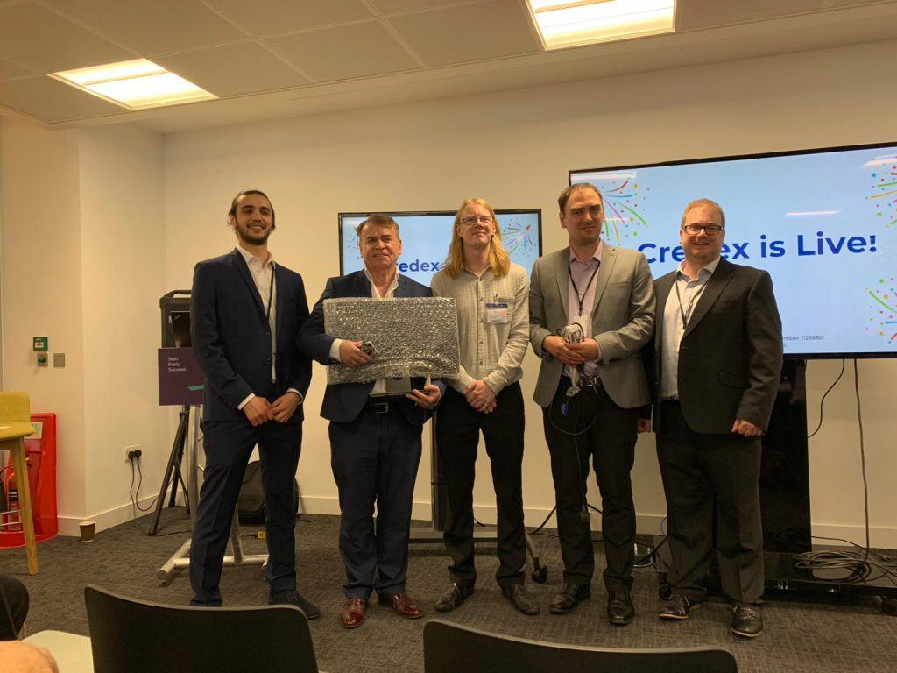

+++
title = "Launch of Parity in Birmingham"
description = ""
date = "2019-04-11"
categories = ["Business Development","Company News","Regional News"]
tags = []
author = "Stuart Bowles"
social_image = "Credex-Launch-Event.jpg"
social_image_alt_text = "Credex Launch Event"
+++

## Launch of Parity in Birmingham

<strong> UK’s first business credit network launched in the West Midlands </strong>

Parity hosted its launch event on Tuesday 9th of April at the NatWest Accelerator in Brindley Place, Birmingham. It was well attended by stakeholders from across the West Midlands who were interested in how Parity could help small businesses. We are the first business credit network in the UK and aim to support the regional economy. Parity offers a platform that can be accessed via mobile and web applications. It provides zero interest credit for purchases from other businesses in the network. In turn this means users connect with new customers and suppliers; creating more trading opportunities.

Parity is a spin-out from the University of Birmingham that has been developed for 18 months by researching highly successful business credit networks in Italy ([Sardex](https://www.ft.com/content/cf875d9a-5be6-11e5-a28b-50226830d644)) and Switzerland ([WIR Bank](https://www.wir.ch/)). The WIR Bank was started in 1934, has more than 60,000 businesses and facilitates around €1.4 billion worth of transactions each year. Sardex launched in 2009 and has grown from €133,000 worth of annual transactions to €40million between 4500 businesses in 2017. These networks provide businesses access to zero interest credit that acts as a source of short-term liquidity. Businesses in these networks are shown to be better decision-makers, are more resilient, have greater lifespans and conduct around 15% more trade.

The event began by identifying challenges that face small businesses and the wider region ([view slides here](https://drive.google.com/file/d/1ElHlbX15pp7QhL02_VFAKqOylN13WZy9/view?usp=sharing)). We believe a business credit network could help alleviate some of these issues. We highlighted how the West Midlands also has lots of positive features that could make it highly effective; a young entrepreneurial population, high cultural diversity, strong business networks and a range of supply chains. A business credit network could promote greater integration among regional businesses, encouraging more resilience and boosting the local economy.

[Parity](/how-it-works) offers a platform where businesses have a balance in a unit of account called; CRX. Each balance is provided a credit facility that allows businesses to make purchases. CRX is a unit that is always equal to Pound Sterling, but can’t be withdrawn from the network. It is easily added to company accounts and provides a new source of liquidity to support cash flow. The credit facility is always zero interest and there are no transaction fees. Users are charged a monthly subscription to be a part of the network, although it is completely free throughout 2019.

<strong>How does Parity work?</strong>

<figure class="wp-block-image"></figure>

Our cofounder Max Edwards asked the audience to download the app that is available on the [Android](https://play.google.com/store/apps/details?id=network.parity.app) and [Apple](https://itunes.apple.com/us/app/parity/id1456139278?mt=8) app stores. Everyone was handed a card that provided login details and a description of a business that they would pretend to be that morning. The aim of the session was to demonstrate the technology and the concept of a business credit network. The audience enthusiastically downloaded the app and over coffee began networking. Each account began with a balance of 0.00 CRX and had a credit facility of 2500.00 CRX, that acts like an overdraft. Audience members used the credit facility make pretend purchases from one another based on the sales information on the cards they were provided. Purchases resulted in the value being subtracted from the buyer and added to the seller. Companies who were negative, made sales to recover their balance. Companies that were positive, could buy products and services for their business.

To give an example; [Molly Thompson](https://www.linkedin.com/in/molly-thompson-5b141654/) from [Silicon Canal](https://siliconcanal.co.uk/) pretended to be a business offering equipment hire. With her CRX credit facility, she was able to make purchases from other businesses within the room without incurring interest or transaction fees. She made pretend purchases of cleaning services and a vending machine for her office. To repay her negative balance, she offered equipment hire to other businesses in the room. Molly said, “I never knew how good I was at selling forklifts! If I was an actual business, the Parity app would have connected me to new customers and boosted my sales. With the CRX credit facility, I was able to make instant purchases without incurring interest or charges.”

At the end of the demonstration, we analysed the data from the demonstration to give the audience an idea of economic impact Parity could potentially have. The audience had created the equivalent of £23,400 worth of zero interest credit through their 135 transactions. All of this was achieved within half an hour, which in turn supported more connections and introductions between members of the audience. The business credit network allowed them to buy and sell pretend products to one to another. The CRX credit facility meant that goods and services could be exchanged without the need for Pound Sterling. In the real world, that would have meant the companies would have freed up their Pounds for more productive activities and investments.

We then hosted the first actual transaction on the Parity business credit network. [Breslins Birmingham Ltd](https://www.breslins.co.uk/) from the Jewellery Quarter and [Repc Ltd](https://repcltd.co.uk/) a social enterprise from West Bromwich, are the first two businesses in the network. Breslins used its CRX account to make a purchase of a computer screen from Repc Ltd. [Paul Breslin](https://www.linkedin.com/in/paul-breslin/) said; “Parity is a fantastic concept, the CRX has allowed me to purchase a computer screen for the office, without using Pound Sterling. This is a great finance solution to help small businesses smooth their cash flow”. The transaction was worth £50.00, that means Repc Ltd now has 50.00 CRX to spend in the network. Breslins has a negative balance of 50.00 CRX, that it needs to recover through selling its own services to the network.

The demonstration and the first transaction allowed the audience to understand how a business credit network operates. Parity hopes to develop its network within the region to provide small businesses with zero interest credit and more customers. We are now open for applications for small businesses and have lots of information and videos on our website to explain how it operates. Parity has a list of network requirements that it is currently recruiting for, but if you think your business would be a good fit within this network, [feel free to apply](https://apply.parity.uk). As it’s a new network, it is free for businesses in the West Midlands throughout 2019. We hope that this is the beginning of a long journey to bring the benefits of a business credit network to the West Midlands.
