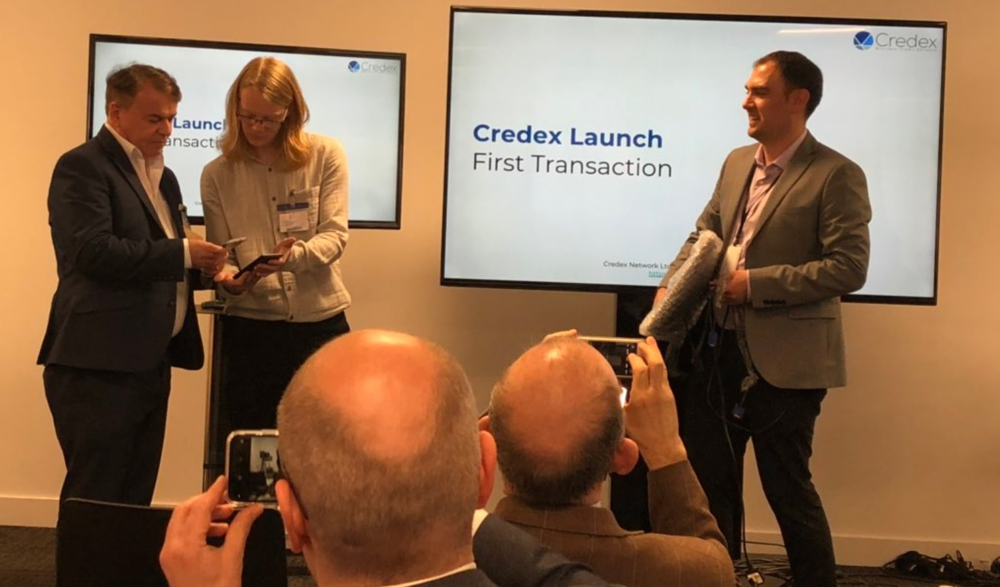

+++
title = "Parity explained through our first Birmingham transaction"
description = ""
date = "2019-04-15"
categories = ["Company News","Regional News"]
tags = []
author = "Stuart Bowles"
+++

## Parity explained through our first Birmingham transaction

Parity is first business credit network within the UK and uses a model that has proven highly successful in Switzerland and Italy. Last Tuesday we had [our launch](https://new.parity.uk/posts/2019-04-11_launch-of-parity-in-birmingham/) in Brindley Place, Birmingham that was well attended by individuals and organisations from across the region. The event hosted a demonstration of our technology, but also provided guests an outline of how Parity works. We actually had our first transactions between two companies on our platform. I thought I would use this transaction as a way of explaining how Parity works and how it could benefit businesses in the West Midlands.

The two companies on our platform are both from the Birmingham-area. [Breslins Birmingham Ltd ](https://www.breslins.co.uk/)is an accountancy and financial advice firm based in the Jewellery Quarter. [Repc Ltd](http://repcltd.co.uk/) is a social enterprise that provides IT equipment to individuals and organisations and is based in West Bromwich. Both companies applied for Parity and were analysed and credit checked. They offer goods and services that are business-to-business; i.e. other companies can buy from them. They were onboarded to Parity and both given an account within the network.

.jpg)

It can be accessed through our mobile application and online portal. They both have a balance that has a unit of account in CRX, that is always equal to Pound Sterling, but cannot be withdrawn from the network. Both of their opening balances were 0 CRX, but they have access to a credit facility that works like an overdraft. As this was public at the event, we made both credit facilities 2500 CRX, but they would usually be based on the analysis done in the application process. This credit facility is zero interest and there are no transaction fees within the network. See this in the image above.

For the event, they had agreed to conduct the first transaction. Breslins needed a computer screen for their office that Repc was selling for £50.00. So in front of a live audience, Breslins made a purchase using their Parity application that allowed them to have the computer screen. Breslins sent Repc 50.00 CRX using their mobile application. This was completed instantly and resulted in Breslins going into their “overdraft” by 50 CRX and Repc having a positive balance of 50 CRX, see below. Parity knows that the services offered by Breslins will be needed by other companies in the network, which is why they are able to use credit. In the future a company will purchase services from Breslins that will help them recover their balance. Repc now has 50.00 CRX to spend with other businesses in the network, which they can use on its own, or with their own overdraft “facility”.

.jpg)

There are a range of advantages of this type of transactions. For Breslins, they have freed up the £50.00 they would have spent on that screen but can be used for more productive investments. Parity provided them with a new source of liquidity, which can help with their cash flow. If there need something and they don’t have the Pound Sterling on hand, they can use Parity for that purchase. For Repc, they have been connected to a new customer and have made an additional sale. That computer screen could have been just sitting on the shelf. They now they have CRX that can used to buy goods and services for their business activities. This becomes very effective when there are a greater range of businesses on the network. The question I always get is; “what if one of them leaves?”. In the case of Breslins, they will be charged an exit fee equal to their negative balance; e.g. £50.00. This reduces the chances that they will abuse the credit facility. In the case of Repc, they will have a year to spend their positive balance. These restrictions aren’t meant to catch these companies out, they just ensure everyone can trust the network they are using.

Parity is now live for businesses in the West Midlands. We have produced a list of companies that we would like to bring on to the network, you can [review it here](https://new.parity.uk). We also have a very cost effective [pricing](https://new.parity.uk); if you don’t want to use credit and just sell your goods and services, there is no cost. If you want to have a credit line to make purchases before selling, it starts at £25 per month. However, as we are new, we are offering the whole network free in 2019. There are a range of benefits even if a company doesn’t want to use the credit. You are connected to new customers that creates new business opportunities, which will ultimately grow your company. If Parity is something that is interesting to you, feel free to [contact us](https://new.parity.uk/contact-us/) or [apply online](https://new.parity.uk).
