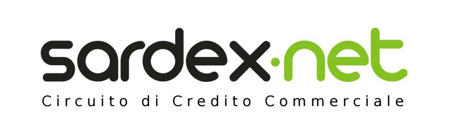

+++
title = "An innovative financial model that supports sustainable development"
description = ""
date = "2019-04-16"
categories = ["Industry News"]
tags = []
author = "Stuart Bowles"
+++

## An innovative financial model that supports sustainable development

### Sardex offers an interesting way to support sustainability

Parity has been developed through studying different models around Europe, including Sardex in Sardinia. I originally went down this path looking for alternative financial mechanisms to support sustainable development. I initially was looking at the [Bristol Pound](https://bristolpound.org/), a local currency that gets a lot of positive media attention in the UK. Local currencies are often described as a model for supporting sustainable development. Advocates hope that they could achieve some of the following outcomes for sustainability; localise supply chains, provide credit for small or green businesses, reducing environmental footprints and providing investment mechanisms for low carbon technologies. After studying the Bristol Pound, although there seemed to be a decent uptake in the city, I found no evidence that these outcomes were being met. However, I spent some time in Sardinia, Italy studying a projet called [Sardex](https://www.sardex.net/?lang=en). Many of these objectives are being achieved within their network

Firstly, a brief explanation of Sardex. It started in Sardinia, Italy in 2009 and is a “commercial credit circuit” for small businesses on the island. Businesses join Sardex and are provided a balance within a network currency called SRD. The initial balance is 0 SRD, but companies are provided a credit facility like an overdraft. SRD is always equal to the Euro, it can be spent with any other member of Sardex, but can’t be withdrawn from the network. The credit facility is useful, as access to finance is a problem for small businesses across Europe and Sardex is zero interest. You can read more about how the model works in this [Financial Times](https://www.ft.com/content/cf875d9a-5be6-11e5-a28b-50226830d644) article, or watch our video on [how Parity works](https://www.youtube.com/watch?v=zoOcDY0c5GE) to get an idea. By its very nature it is providing credit for small businesses, an outcome that advocates were hoping local currencies could achieve

There is also strong evidence that Sardex is localising some of the supply chains of the businesses within its network. The credit provided within Sardex can only be spent with other companies on the network, which are all based in Sardinia. So it is encouraging local procurement. I spoke with a restaurant owner who before Sardex was purchasing all of his supplies from the French multinational Carrefour. After joining Sardex he was connected to local suppliers and products such as wine, cheese and vegetables are sourced locally. I also interviewed a construction business who was completing an extension that had been paid in Sardex. The construction business had bought everything it needed for the project with Sardex; materials, supplies, equipment and was even taking some of his wage in the credit. The localisation of these supply chains reduce the environmental impacts of the products, as they are not been shipped from around the world. They are also establishing local connections creating more resilient small businesses.

.jpg)

Another area that Sardex could support was investments in low carbon technologies. I engaged with an installer of energy efficiency and renewable technologies who accepted Sardex as payment. They spoke about how their business customers benefited from the service, as they were essentially; “turning Sardex into Euros”. What they meant was that small businesses could investment in energy efficiency and renewable technologies using Sardex, that would result in lower energy bills that they pay in Euros. This was a highly positive series of steps; the small business would have received Sardex through connecting with new customers and trading opportunities. They then were able to spend the Sardex on an investment in their business that reduced costs, made them more efficient and lowered their environmental footprint. Small businesses have been an especially difficult group in the UK to engage on energy efficiency, so it is interesting that Sardex was making such an impact.

Sardex has also recently launched another product that it calls Efficio. This provides businesses with another credit line for investments. If a business is doing especially well in Sardex; for example earning €30,000 worth a year, they can ask for an Efficio credit line of say €90,000. This Efficio credit line could then be paid back over three years. It provides businesses the opportunity to make even larger investments within their business, which could include energy efficiency and renewable technologies. An example of this was a dentist who was especially popular in the network. He was receiving a huge amount of work and therefore used a Efficio credit line to invest in his business. He completely rebuilt his dentist surgery using high energy efficiency principles, of which was around 10% of the total project was in Sardex. The building has a roof garden, rainwater collection, high quality local materials, photovoltaic solar panels and techniques such as large windows to maximise natural daylight. You can read more about it [here](https://sardex.net/sardex-realizzero-progetto-volevo/) (needs browser translation). It is hoped that this one of many investments using the Efficio credit line.

.jpg)

For the world to seriously address its current environmental problems, it will need a wide range of solutions to help transition to a more sustainable society. I think Sardex provides an interesting example of the way alternative and highly innovative financial mechanisms could be used to support sustainable development in regions across the world. We hope that with the [launch of Parity](/posts/2019-04-11_launch-of-parity-in-birmingham/) that maybe one day we will be able to deliver such exciting projects within our network.
