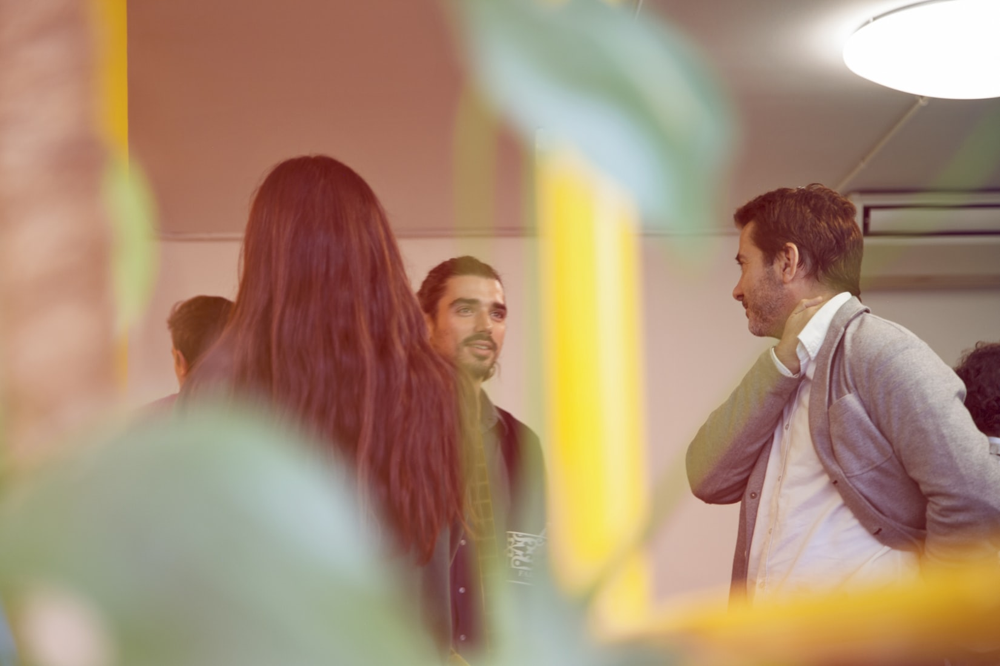
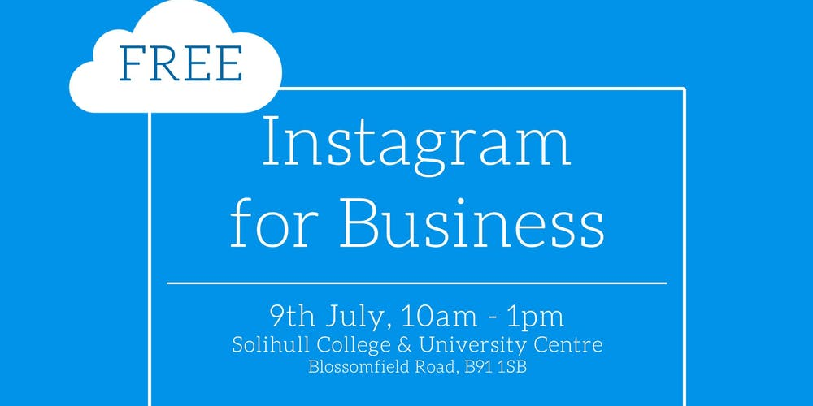

+++
title = "Business Networking Events in Birmingham, West Midlands."
description = ""
date = "2019-07-08"
categories = ["Networking Events"]
tags = []
author = "Matteo Vanzini"
social_image = "networking.jpg"
social_image_alt_text = "Image of people attending a networking event"
+++

## Business Networking Events in Birmingham, West Midlands.

At Parity we believe in networking, not only as part of our business operations, but also as a way to improve ourselves and learn new things from other people. Luckily, the Birmingham area is rich with opportunities and you have the chance to engage in these business networking events over the course of the coming week.

Below are a list of  events where you can attend to meet local entrepreneurs, and while your there why not meet someone from Parity and find more about this [innovative business network](/about-us).

## Business events on Tuesday, 9th July 2019

Our networking schedule starts on the 9th of July. As every second Tuesday of the month, in the “Grosvenor Casino Birmingham” at 10am there will be another [Brummies Networking](https://brummies-networking.co.uk/) event and on the same morning Parity will be also elsewhere. Indeed, in the Solihull College &amp; University Centre our team will participate in the workshop [Instagram for Business](https://www.eventbrite.co.uk/e/instagram-for-business-tickets-64167518776). In the 21st century is important to know how to use social media and what’s better than an event merging online and offline networking?

In the evening Birmingham offers two different opportunities for different kind of entrepreneurs and businesses. On one hand the [Birmingham Entrepreneurs Meetup](https://www.meetup.com/Birmingham-Entrepreneurs-Meetup-Group/events/qmtsgqyzkbmb/) that, in the city of “the thousand trades”, could have not found a better location. Yes! At the [1000 Trades](http://1000trades.org.uk/) in the Jewellery quarter. On the other hand instead, if you feel to be more a tech entrepreneur you cannot miss the [Tech Nation Talk](https://technation.io/events/tech-nation-talks-midlands-60865550500/) hosted at [Innovation Birmingham](https://www.innovationbham.com/). Meet the people coming together to support this growing tech ecosystem across the UK.

## Business events on Wednesday, 10th July 2019

On Wednesday the 10th at 1pm the [Pathway2Grow Coffee &amp; Natter ](https://www.eventbrite.co.uk/e/wolverhampton-coffee-natter-free-business-networking-wed-10th-july-2019-tickets-62137419695?ref=ecal)stops in Wolverhampton at the Ramada Park Hall Hotel. Parity team has appreciated Coffee &amp; Natter events and at those, besides a formative keynote speaker, you can enjoy networking in a relaxed and easy environment.

After 6:00pm Parity will be simultaneously at the 1000 Trades to meet the [Rebel Meetups - Young Entrepreneur Networking in Birmingham](https://www.meetup.com/rebel-meetups-young-entrepreneur-networking-birmingham/events/261507873/); and in the Edgbaston Park Hotel for the [Eid Celebration 2019](https://www.greaterbirminghamchambers.com/networking-events/events-calendar/listing/networking-eid-celebration-2019/details) with the [Great Birmingham Chamber of Commerce](https://www.greaterbirminghamchambers.com/). In this occasion Parity will celebrate this important religious holiday besides meeting with the Muslim community who has shown interest for our 0% interest credit system which is shariah compliant.

## Business events on Thursday, 11th July 2019

On Thursday the 11th, in the afternoon you can move from a workshop in the “Hotel du Vin &amp; Bistro”, to a meetup in the Italian food venue “Fumo”. The former, [Win your next client on LinkedIn](https://www.eventbrite.co.uk/e/win-your-next-client-on-linkedin-birmingham-sell-more-close-more-and-win-more-business-through-tickets-57800892024?aff=ebdssbdestsearch), starts at 1pm and for 3 hours will help you develop your strategy for B2B and B2C sales. The latter instead, [Birmingham Small Business Meetup](https://www.meetup.com/it-IT/Birmingham-Small-Business-Meetup/events/nrfxvqyzkbgb/), is more informal and for a couple of hours will give you the opportunity to talk with other local entrepreneurs accompanied by some nice cocktails and Italian food.
