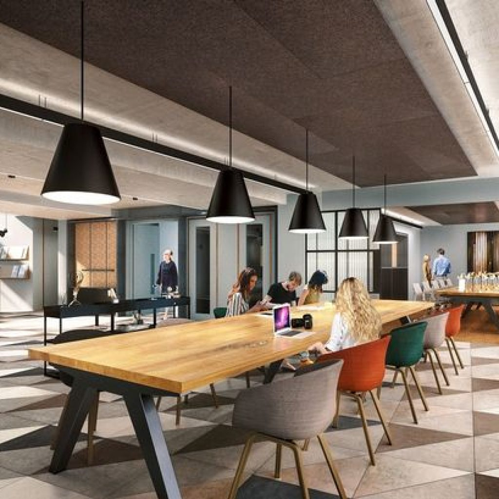
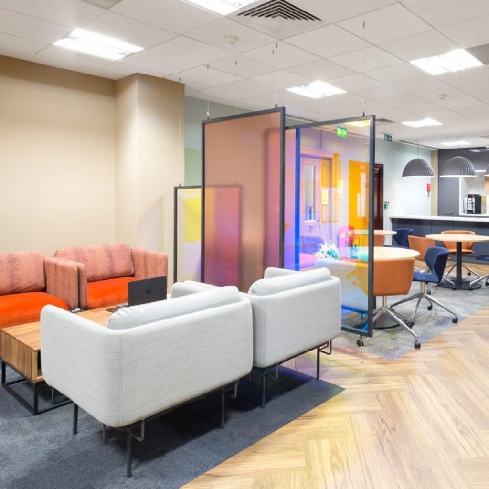
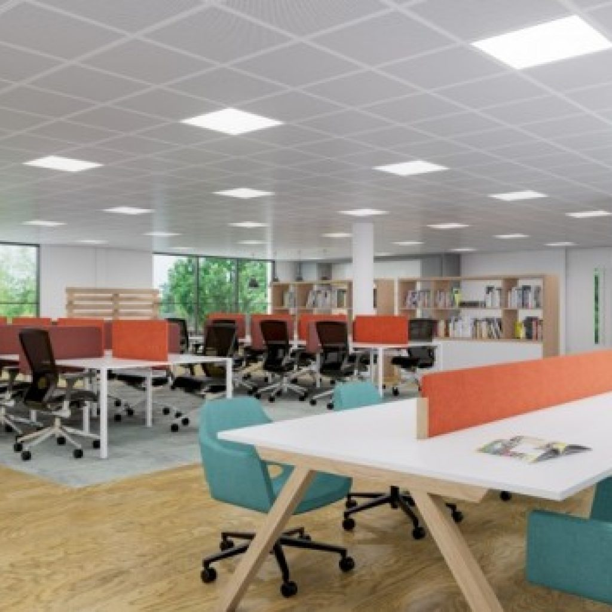
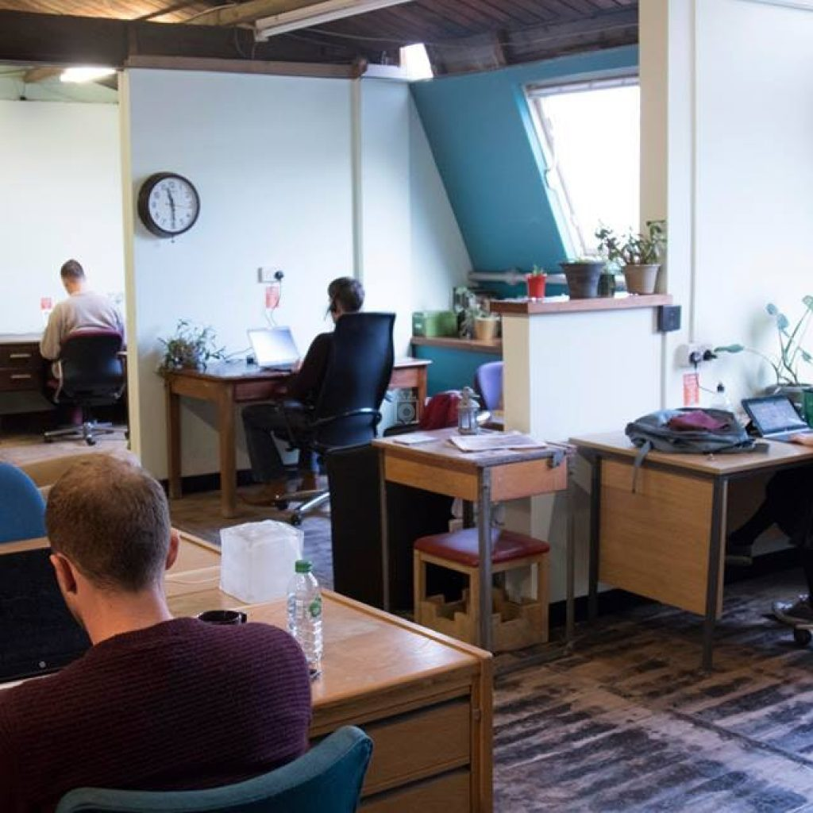

+++
title = "Best Coworking Spaces Birmingham"
description = ""
date = "2019-07-16"
categories = ["Uncategorised"]
tags = []
author = "Stuart Bowles"
social_image = "coworking.jpg"
social_image_alt_text = "Picture of people around the table and a woman taking notes"
+++

## Best Coworking Spaces Birmingham

### What is coworking?

Are you looking for a new work space? Do you want to separate work from home? Tired of rummaging through busy Birmingham cafés for a seat for moment of focus? Or maybe you’re tired of the hefty expenses of long-term office leases? Are you looking for an environment that can help you unlock your full potential and inspire greater business productivity? Then coworking space in Birmingham may be perfect for you.

Coworking spaces are a new way to work. They are cost-effective office-like spaces which offer a professional yet comfortable work space. Coworking spaces are a great place to meet clients and are also great for building a network. Coworking spaces also offers more flexibility and job control for their users.

Coworking spaces are filled with like-minded professionals in a creative environment which can help you become more productive, and therefore more successful. This combats the infectiveness of traditional working spaces yet offer the perks of office facilities. These spaces are perfect for freelancers, start-up founders, business professionals and the like.

Here's the best five coworking spaces in Birmingham:

### Alpha Works

 Alpha works is recognised as housing some of the ‘best workspaces in Birmingham City’. Motivated by their motto – ‘work, connect, create be’, Alpha works has been specially designed with its user in mind. Located in the heart of the business Birmingham area, Alpha Works is a modern styled office space with a spectacular, unmatched view of the city of Birmingham. Alpha works is a serviced office space offering a variety of facilities; include a fully equipped kitchen, cycle storage, shower and changing facilities. Alpha Works provides a professional yet comfortable and convenient work environment. All this is offered for a range of prices which include daily charges to fixed monthly fee.

Location: Alpha Tower, Suffolk Street Queensway, Birmingham B1 1TT

[Visit Website](http://www.alphaworksb1.co.uk/)

### Landmark, Brindleyplace

The Landmark is a spectacular work space, with stylish interior. The Landmark offers a wide choice of different work spaces; individual, social, collaborative and meeting places. Located by in the heart of the Birmingham business district, The Landmark is here to meet your co-working needs. Loved by its client, The Landmark is a renowned location, offering security and secure on-site car parking so you can avoid the hustle and bustle of the City.

Location: 3 Brindley Pl, Birmingham B1 2JB

[Visit Website](https://www.landmarkspace.co.uk/locations/birmingham-brindleyplace/)

### Regus

 Regus offers unique spaces, in the vibrant heart of Birmingham. Located around the world, its clients have a variety of fully serviced office spaces to choose from in the Birmingham area. With no set-up required you can get stuck into work and be well on your way to success. Regus offers an efficient payment service where you only pay for what you need, so no penny is wasted. At Regus you have the ability to work where you want in the Birmingham city and you get to choose from stylish hot-desking spaces to professional permanent reserved co-working offices.

 Location: Multiple Birmingham city centre locations

[Visit Website](https://www.regus.co.uk/offices/united-kingdom/west-midlands/birmingham/coworking-space)

### The Transfer

The transfer is a professional value motivated working space which promotes a friendly work environment. This affordable co-working space prides itself on creativity, sustainability, localism and community. The Transfer is situated in The Old Print Works and it offers both comfortable collaborative spaces and secluded areas to work effectively.

Location: The Old Print Works, 498-506 Moseley Road, Balsall Heath, Birmingham  B12 9AH

[Visit Website](https://www.oldprintworks.org/transfer)

### Impact Hub Birmingham

The Impact Hub Birmingham is just one of the global networks of co-working spaces globally. The Impact Hub Birmingham offers its users an abundance of professional and comfortable work spaces. This space is great for all kinds of individuals and is home to like-minded professional while presenting a wide variety of offers for its users.

 Location: Walker Bldg, 58 Oxford St, Birmingham B5 5NR

[Visit Website](https://birmingham.impacthub.net/)

### Final thoughts

The benefits of coworking space in Birmingham are endless, and ultimately offer a new and productive way to work. So, if you are a budding entrepreneur or a professional team who need a environment that will help inspire creativity without the pressure of expensive financial ties, co-working spaces may be your final stop to success. If your business is looking for new and creative ways to connect with clients, [Parity](/how it works) offers a digital platform to connect to local sales opportunities.

What are your favourite places to work when in Birmingham? Let us know and we can add it to our list of the best co-working spaces in Birmingham.
