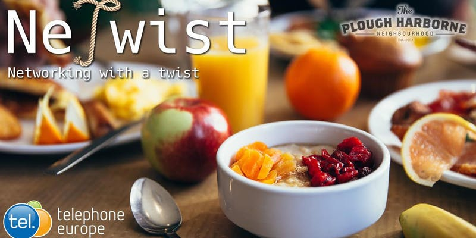
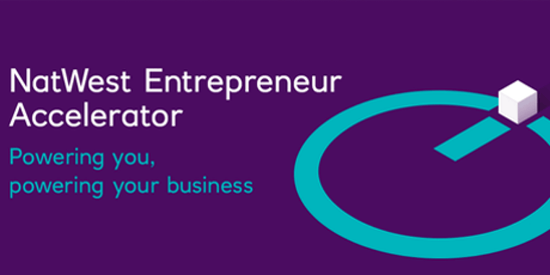
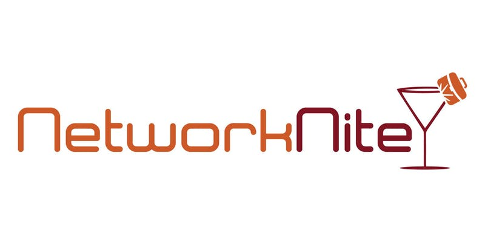
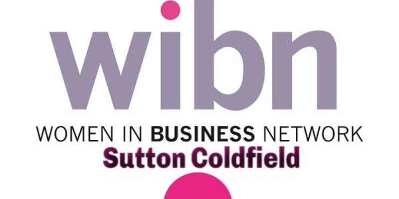
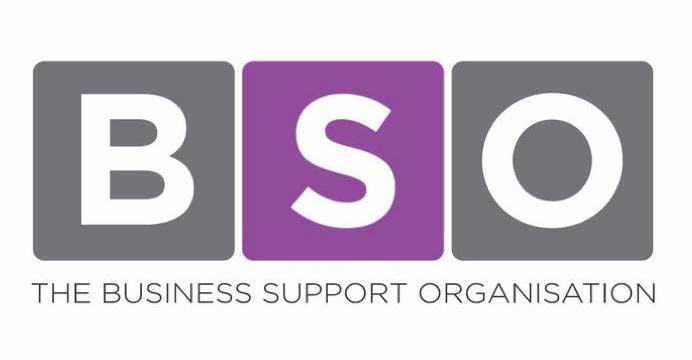

+++
title = "Business Networking Events w/c 22nd July 2019."
description = ""
date = "2019-07-19"
categories = ["Networking Events"]
tags = []
author = "Matteo Vanzini"
social_image = "Weekly-Events.jpg"
social_image_alt_text = "A white poster stating weekly events"
+++

## Business Networking Events w/c 22nd July 2019.

Business is made of human relationships and in Parity we believe these are stronger and more trust worthy at local level. Find out how Parity supports local market and follow our weekly blog on networking events in Birmingham and West Midlands.

## Monday 22nd of July

#### FREE 4 Day Business Start-up Workshop

The programme is delivered by Award winning Business Advisors who run their own businesses and have many years experience in a wide range of industries. The course is designed to provide people with all the information necessary to launch a business.

When: 22/07/2019 - 9.30am
Where: Changes UK, 8-9 Allcock St, Birmingham,B9 4DY
Cost: free
Reserve a place: <https://www.eventbrite.co.uk/e/birmingham-free-4-day-business-start-up-workshop-tickets-46837816169?aff=ebdssbdestsearch>

## Tuesday 23rd of July

#### Greater Birmingham Chamber of Commerce
Speed Networking

Chamber Speed Networking is a business networking event designed for you. It’s fun. It’s fast. It’s effective. Networking can be daunting for some; however delegate feedback suggests that Speed Networking is a great introduction to networking.

When: 23/07/2019 - 8.30am - 10.30am
Where: The Cathedral Lodge Hotel, 62 Beacon Street, Lichfield, WS13 7AR
Cost: £15 (free for GBCC members)
[Reserve a place](https://www.greaterbirminghamchambers.com/networking-events/events-calendar/listing/speed-networking-10-2/details)

#### Netwist
Business Networking with Breakfast &amp; Unlimited Coffee

Relaxed networking events. Professional Business Networking Breakfast meeting located in the stylish gastro pub of The Plough, Harborne (Birmingham).

When: 23/07/2019 - 9.00am - 10.30am
Where: The Plough, 21 High Street, Birmingham, B17 9NT
Cost: £15
[Reserve a place](https://www.eventbrite.co.uk/e/netwist-business-networking-birmingham-with-breakfast-unlimited-coffee-tickets-63188492482?aff=ebdssbdestsearch)

## Wednesday 24th of July

#### Old Bank Business
Networking specially for SME's

Old Bank Business is an exclusive, monthly, breakfast networking group specifically for local SME's in the Black Country. These business networking events will be run on the last Wednesday of each month. Is your business 1 or 25 years old or even longer? then this networking group is for you. Come and enjoy a complimentary breakfast and meet the sort of people who will help you grow your business.

When: 24/07/2019 - 9.30am
Where: Old Bank Business Centre, 43-45 Church Street, Wednesbury, WS10 8DU
Cost: free
[Reserve a place](https://www.eventbrite.co.uk/e/networking-old-bank-business-networking-specially-for-smes-tickets-44609820173?aff=ebdssbdestsearch)

#### My Business Buddies Lunch

We believe that business happens when people connect and build great business relationships. Join and start making those important relationships or reconnect with people that you already know. Great business relationships truly lead to great referrals!

When: 24/07/2019 - 12.00pm - 2.30pm
Where: The High Field, 22 Highfield Road, Birmingham, B15 3DP
Cost: £24.50 – £27.50
[Reserve a place](https://www.eventbrite.com/e/my-business-buddies-lunch-tickets-63067256863?aff=ebdssbdestsearch)

 

#### NatWest Entrepreneur Accelerator
Entrepreneur Network Event - Sales \#PowerUp

Everybody knows that increasing your sales is vital to support the long term growth of a business, yet few people regard themselves as great sales people and comfortable to do so. In this network event we will help share new skills and techniques that can support you to increase your sales, and support a sustainable future.

When: 24/07/2019 - 4.30pm - 6.30pm
Where: 7-8 Brindley Place, Birmingham, B1 2TZ
Cost: free
[Reserve a place](https://www.eventbrite.co.uk/e/entrepreneur-network-event-sales-powerup-tickets-63339247394?aff=ebdssbdestsearch)

#### Networknite
Business Networking in Birmingham

Speed Networking works a lot like 'Speed Dating' without the 'Dating'. A structured opportunity to meet accomplished professionals just like yourself, face to face, one business professional at time.

When: 24/07/2019 - 7.00pm - 9.00pm
Where: Felson's Cocktail Lounge, Ground Floor, 266 Broad St, Birmingham, B1 2DS
Cost: £22.50
[Reserve a place](https://www.eventbrite.com/e/business-networking-in-birmingham-networknite-business-professionals-tickets-59850305876?aff=ebdssbdestsearch)

## Thursday 25th of July

#### Black Country Chamber of Commerce
BEING PRESENT &amp; PRODUCTIVE

Being Present and Productive is very business relevant and work related, however, it also crosses over into participants personal productivity and looks at elements beyond the workplace which have a pronounced impact on a person’s productivity inside the workplace.

When: 25/07/2019 - 9.00am - 4.30pm
Where: Creative Industries Centre, University of Wolverhampton Science Park, Glaisher Drive, West Midlands, WV10 9TG
Cost:  £325.00 (£285 for members)
[Reserve a place](https://www.blackcountrychamber.co.uk/events/25072019/being-present-productive/)

#### Birmingham Morning Latte Networking

Latte Networking events are held bi-monthly in the morning to help those who don't do breakfast and those who can't do breakfast still have the chance to meet, connect and grow. These networking events have an inspiring 10-minute speaker to kick start your day the right way.

When: 25/07/2019 - 9.30am - 11.30am
Where: Headspace Group, Somerset House, 37 Temple Street, Birmingham, B2 5DP
Cost: £7.50 – £12.50
[Reserve a place](https://www.eventbrite.co.uk/e/birmingham-morning-latte-networking-tickets-63104122128?aff=ebdssbdestsearch)

#### NoW Network
Family Summer Picnic

This is a social event for everyone to come together during the school holidays, connect with other businesses, mums, children, all having fun together. Please bring your own blankets, chairs, food and drink (allergies etc) prepare like your going to your picnic so we will all be organised for the day

When: 25/07/2019 - 10.30am - 2.30pm
Where: Higham on the Hill Park, The Park, Higham on the Hill, CV13 6AP
Cost: free
[Reserve a place](https://www.eventbrite.co.uk/e/now-network-family-summer-picnic-tickets-63500764496?aff=ebdssbdestsearch)

#### Women in Business Network
Sutton Coldfield

WIBN is a strong and growing Nation of Business Women that rise by lifting each other. Join the new Sutton Coldfield Group; a friendly and safe environment in which to network with likeminded Women.

When: 25/07/2019 - 12.00pm - 2.00pm
Where: Ramada HotelRamada Hotel, Penns Lane, Sutton Coldfield, B76 1LH
Cost: £28
[Reserve a place](https://www.eventbrite.co.uk/e/women-in-business-network-sutton-coldfield-tickets-58660933431?aff=ebdssbdestsearch)

#### Social Circle July

Social Circle was born from monthly get-togethers between friends, where we’d gather round with a few drinks and chat about the latest in social media marketing. We wanted to be better for ourselves, for our clients, and because we just really love social media. Circle for digital marketers, with the goal to take social to the next level and share inspirational, instant, and actionable insights

When: 25/07/2019 - 5.30pm - 8.00pm
Where: 1000 Trades, 16 Frederick Street, Birmingham, B1 3HE
Cost: free
[Reserve a place](https://www.eventbrite.co.uk/e/social-circle-july-tickets-64413690081?aff=ebdssbdestsearch)

#### Business Support Organisation
BSO Evening Event - Making Networking Pay

The topic for this business networking event is Networking. With over 11 years in the business organisation industry BSO will be sharing the benefit of their experience and sharing tips that will guarentee a huge increase in returns from your networking activity.

When: 25/07/2019 - 6.00pm - 8.30pm
Where: Walsall Golf Club, Broadway, Walsall, WS1 3EY
Cost: free
[Reserve a place](https://www.eventbrite.co.uk/e/bso-evening-event-making-networking-pay-tickets-63550690827?aff=ebdssbdestsearch)

## Friday 26th of July

#### Greater Birmingham Chamber of Commerce
Summer Networking BBQ

The Summer Networking BBQ is the perfect opportunity to make some new contacts and develop existing business relationships in a relaxed and informal environment, on thestudio’s fabulous roof garden in the heart of Birmingham city centre. It’s a fantastic setting for soaking up the afternoon sun whilst gaining potential new business.

When: 26/07/2019 - 11.30am - 2.30pm
Where: thestudio, 7 Cannon Street, Birmingham, B2 5EP
Cost: £25
[Reserve a place](https://www.greaterbirminghamchambers.com/networking-events/events-calendar/listing/summer-networking-bbq-3/details)

#### Coffee &amp; Natter. Birmingham

The Pathway2Grow "Coffee &amp; Natter" business networking event is relaxed networking centred around a guest speaker which will involve a presentation on a topic of interest to anyone seeking self-development &amp; personal and business growth.

When: 26/07/2019 - 1.00pm - 3.00pm
Where: Natwest, 2 St Philips Place, Birmingham, B3 2RB
Cost: free
[Reserve a place](https://www.eventbrite.co.uk/e/birmingham-coffee-natter-free-business-networking-fri-26th-july-2019-tickets-64663656738?aff=ebdssbdestsearch)

## Sunday 28th of July

#### SD Prints
Business Networking Event

A Business Networking Event, with 46 Vendors networking. The Event will Consist of: 5 Key note Business speakers. Advice on how to start a New Business - What funding, courses and support their is available. Business Networking - Small Businesses will be showcasing their products and services on the day. Raffle, goody bags and presentation of small business Award.

When: 28/07/2019 - 12.00pm - 6.00pm
Where: The Hangar, Pountney Street, Wolverhampton, WV2 4HX
Cost: £4.85
[Reserve a place](https://www.eventbrite.co.uk/e/sd-prints-business-networking-event-tickets-57745591619?aff=ebdssbdestsearch)
