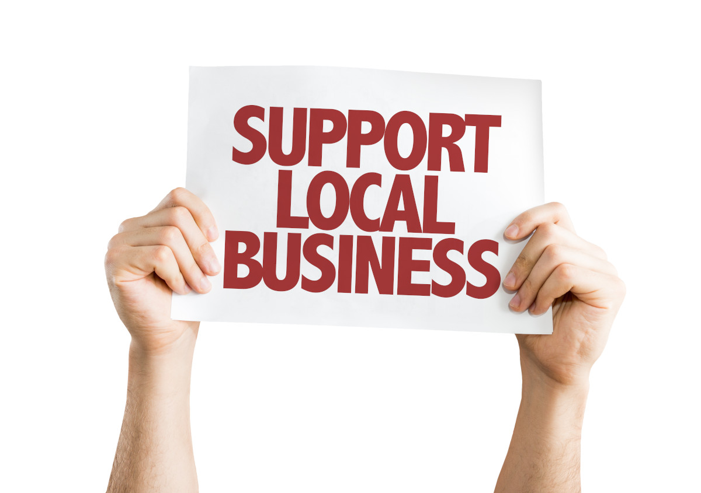
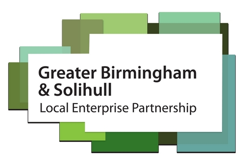
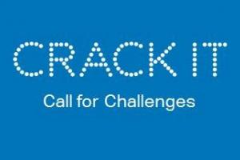
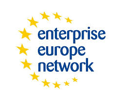
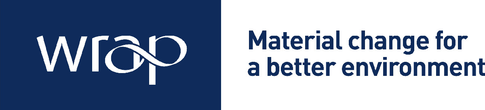

+++
title = "Business Support for West Midlands Businesses"
description = ""
date = "2019-07-24"
categories = ["Regional News"]
tags = []
author = "Matteo Vanzini"
social_image = "Support-Local-Business.jpeg"
social_image_alt_text = "A poster stating support local business"
+++

## Business Support for West Midlands Businesses

Starting a business can be liberating, however the journey to business growth and increased cashflow can be challenging. From the onset you may not have all the expertise or even the resources necessary for your business to prosper and thrive. [Parity](/how-it-works) aims to support your growth offering a local network and an innovative cashflow solution.

Why is business support important?

Having the resources, youneed such as expertise, advice and access to finances from business supportservices can help boost the productivity of your company. With all this athand, you’ll be better able to achieve a work-life-balance and ultimately allowyour business to reach its full potential.

Here is a list ofbusiness support service and business growth programme and business growthfunds that are available to business in the West Midlands and the eligiblecriteria for business who require the services.

#### Business SupportProgramme – Coventry &amp; Warwick

Thisprogramme is flexible support service for start-up and established businesseswith the potential for growth in Coventry and Warwickshire offering expertiseand advice.

Who is it for?

Start-upsand established businesses with the potential for growth.

Industry: Agriculture and food, Businessand finance, Construction. Education, Health, Hospitality and catering, IT,digital and creative, Manufacturing, Mining, Real estate and property, Scienceand technology, Service industries, Transport and distribution, Travel andleisure, Utilities providers

Number of employers?

0-249

Type of support?

Expertiseand Advice

What can you get?

You canget support from a variety of experienced local providers, including:

*   Starting a business
*   Addressing barriers to growth
*   Specialist sector support
*   Workshops, events and seminarsto provide networking and supply chain opportunities
*   Accessing finance
*   Referrals to other specialistbusiness support programmes
*   A recruitment service designedto meet the needs of employees
*   Improving health and well-beingin the workplace

[Visit website](https://www.warwickshire.gov.uk/cwbsp)
[contact@cwgrowthhub.co.uk](mailto:contact@cwgrowthhub.co.uk)
call 0300 060 3747

#### Business GrowthProgramme 2 – Greater Birmingham &amp; Solihull

Thisprogramme offers grant support for growth business trading over 6 months in theGreater Birmingham &amp; Solihull LEP area.

Who is it for?

Thisprogramme is for that trading business to business and the project must createjobs. Businesses based in or moving to the areas mentioned - Birmingham,Solihull, Bromsgrove, Cannock Chase, East Staffordshire, Lichfield, Redditch,Tamworth, Wyre Forest

Industry

Businessand Finance, Construction, IT, Digital and creative, Manufacturing, Science andtechnology, Transport and distribution, Wholesale and retail

Number of employers?

0-249

Type of support?

Finance,Grant

What can you get?

Grants can cover:

*   capital equipment
*   improvements to production processes and systems
*   the application of innovative advanced technologies
*   relocation and expansion
*   new product development
*   market development
*   Building Information Modelling
*

[Visit Website](https://www.birmingham.gov.uk/bgp2)

#### CRACK IT –Challenges

This is a fund to supportcompetitions which solve business and scientific 'challenges' and delivercommercial benefits.

Who is it for?

Thisfund is for Industry, academics and small and medium enterprise (SMEs),particularly start-ups (1-2 years trading) in the UK interested in taking partin a challenge-led competition and working together to solve business andscientific ‘challenges’.

Industry

LifeSciences, Science and technology

Type of support?

Finance,Grant

What can you get?

The Crack-IT fund enables research tomeet the challenges set by the [NC3RS](https://www.nc3rs.org.uk/)around:

*   discovery and application of newtechnologies
*   use of animals for scientificpurposes

Solving these challenges will deliver:

*   improvements in business processes orthe 3Rs (replacement, reduction and refinement)
*   benefits through the development of aproduct that can be commercialised

[Visit website](https://nc3rs.org.uk/crackit/crack-it-challenges)

#### Enterprise EuropeNetwork – Midlands

Thisscheme offers expert advice for small businesses in the Midlands looking tocommercialise new ideas and succeed in international markets.

Who is it for?

Thisservice is for start-ups (1-2 years trading) established businesses

Industry

Agricultureand food, Business and finance, Construction. Education, Health, Hospitalityand catering, IT, digital and creative, Manufacturing, Mining, Real estate andproperty, Science and technology, Service industries, Transport anddistribution, Travel and leisure, Utilities providers, Wholesale and retail

Type of support?

Finance,Grant, Expertise and advice

What can you get?

You’ll get free tailored support andadvice to help your business innovate and grow internationally, such as:

*   finding the right partners forresearch, development and innovation
*   finding new markets for your products
*   accessing funding and finance
*   assessing and planning your internalresources

[Visit website](https://www.enterprise-europe.co.uk/how-can-we-help)

#### WRAP environmentalbusiness advice – UK

This isscheme offers confidential advice support on environmental issues for all UKbusiness.

Who is it for?

Thisservice is for start-ups (1-2 years trading), established

Industry

Agricultureand food, Business and finance, Construction. Education, Health, Hospitalityand catering, IT, digital and creative, Manufacturing, Mining, Real estate andproperty, Science and technology, Service industries, Transport anddistribution, Travel and leisure, Utilities providers, Wholesale and retail

Number of employees

0-249

Type of support?

Expertiseand advice

What can you get?

Adviceand support on environmental issues to help your business:

*   Increase profitability
*   Reduce its impact on theenvironment

[Visit Website](http://www.wrap.org.uk/)

#### Growing the socialenterprise sector – West Midlands

Thisscheme offers free coaching and expert business advice for pre-start andexisting social enterprises in the West Midlands.

Who is it for?

Thisservice is for those who are not yet trading, or those who have a start-up (1-2years trading), or those who have established companies

You can apply as:

*   a group of 2 or more who wants to set up a socialenterprise
*   a voluntary and community groups
*   an existing business trying to convert to a socialenterprise
*   public sector employees who want externalise theirservice

You must be based in the rurally isolated areas of Warwickshire,Shropshire, Herefordshire, Worcestershire and Staffordshire or the disadvantagedurban areas of Coventry, Birmingham, the Black Country and Stoke.

Existing social enterprises may be eligible for support if they aresmall and medium size enterprises and haven’t received more than 200,000 eurosof aid in the past 3 years

Industry

Agricultureand food, Business and finance, Construction. Education, Health, Hospitalityand catering, IT, digital and creative, Manufacturing, Mining, Real estate andproperty, Science and technology, Service industries, Transport anddistribution, Travel and leisure, Utilities providers, Wholesale and retail

Type of support

Expertiseand advice

[Visitwebsite](http://www.cwcda.co.uk/social-enterprise)

#### Business loanscheme – Coventry and Warwickshire

Thisscheme offers loans for companies in Coventry and Warwickshire that are notable to get finance from mainstream lenders.

Who is it for?

Sole traders, partnerships, limited companies, not forprofit and other community-based organisations that:

*   are based or operate mainly inCoventry and Warwickshire
*   have been unable to secure sufficientfunds through other sources

Industry

Agricultureand food, Business and finance, Construction. Education, Hospitality andcatering, IT, digital and creative, Manufacturing, Real estate and property,Science and technology, Service industries, Travel and leisure, Wholesale andretail

Type of support?

Finance,loan, expertise and advice

What can you get?

You can get a loan to help you with:

*   new premises - lease or rentdeposits, adapting buildings, services, repairs
*   machinery and equipment - new andused
*   increasing your working capital
*   bridging finance
*   other business proposals

[VisitWebsite](https://www.cwrt.uk.com/business-loans)
