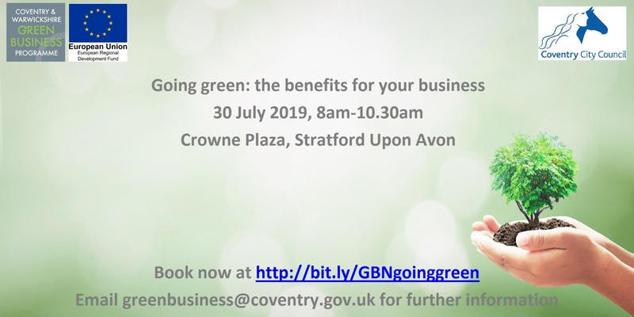
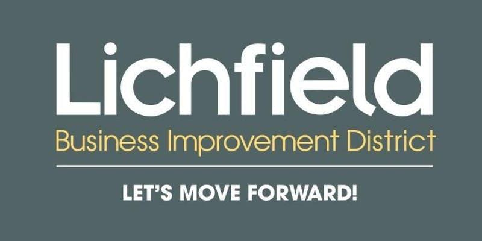
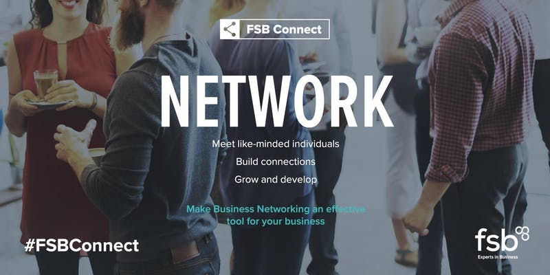
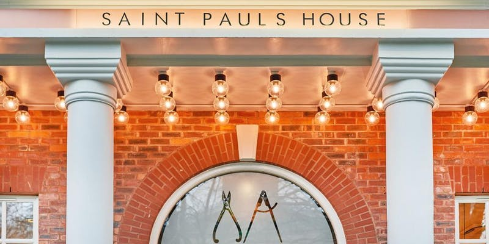
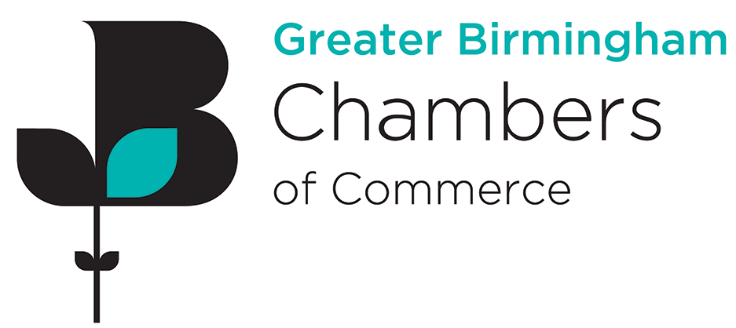
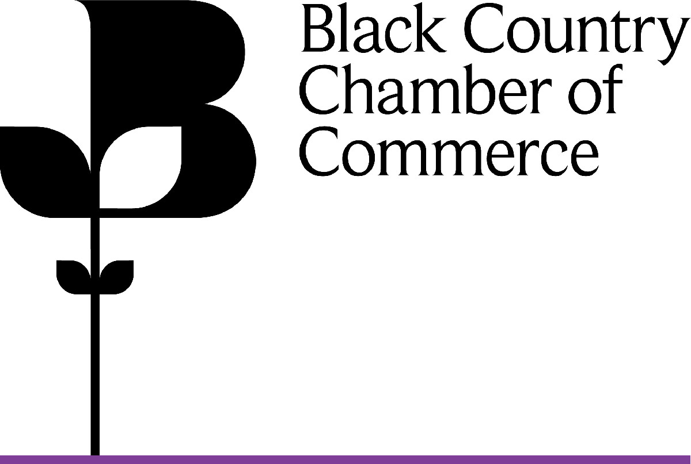

+++
title = "Business Networking Event. w/c 29 of July 2019"
description = ""
date = "2019-07-26"
categories = ["Networking Events"]
tags = []
author = "Matteo Vanzini"
social_image = "Weekly-Events.jpg"
social_image_alt_text = "A white poster stating weekly events"
+++

## Business Networking Event. w/c 29 of July 2019

Business is made of human relationships and in Parity we believe these are stronger and more trust worthy at local level. Find out how Parity supports local market and follow our weekly blog on networking events in Birmingham and West Midlands

### Monday 29th of July

#### Tech. Entrepreneurship 101

These are informal sessions covering business / entrepreneurship topics, looking at basic terminology and methodology with plenty of opportunity for discussion, Q&amp;A, and hands-on work for your own venture plans.
When: 29/07/2019 - 3pm - 4pm
Where: University of Birmingham, Metallurgy &amp; Materials Building, Meeting Room, Birmingham, B15 2TT
Cost: free
[Reserve a place](https://www.eventbrite.co.uk/e/tech-entrepreneurship-101-tickets-66202538575?aff=ebdssbdestsearch)

#### Curry Club Networking

It’s now established as Britain’s favourite meal, and for many of us, you can’t beat a good curry! This business networking event brings together guests over some tasty food and networking in a more relaxed atmosphere - join us at Asha's Solihull for a taste of contemporary Indian food.
When: 29/07/2019 - 5.30pm - 7.30pm
Where: Asha's Solihull, Touchwood Shopping Centre, Homer Rd, Solihull, B91 3QW
Cost: £25
[Reserve a place](https://www.greaterbirminghamchambers.com/networking-events/events-calendar/listing/curry-club-networking-solihull-july/details)

### Tuesday 30th of July

#### 4N Sutton Coldfield Business Breakfast Networking

This business networking event provides plenty of opportunities to meet other local business owners and employees. As well as open networking there’s a 40 seconds introduction round, an informative speaker and three ten-minute 1-2-1 ‘appointments’ with other attendees.
When: 30/07/2019 - 8.00am - 10.00am
Where: The Royal Hotel, High Street, Sutton Coldfield, B72 1UD
Cost: £15
[Reserve a place](https://www.eventbrite.co.uk/e/4n-sutton-coldfield-business-breakfast-networking-tickets-61003493090?aff=ebdssbdestsearch>

#### The Tate Breakfast Club

Tate Birmingham are not just a recruitment company we deliver tailor-made solutions that help companies to ATTRACT quality people, train them so they PERFORM and work with them to RETAIN that top talent. The Tate Breakfast Club will be held on a bi-weekly basis and will be a great opportunity for you to get advice and support from managers and consultants that have over 15 years experience and to also network with other local contacts that may be able to help your business grow.
When: 30/07/2019 - 8.15am - 11.30am
Where: The Alchemist, Colmore Row, Birmingham, B3 2DE
Cost: free
[Reserve a place](https://www.eventbrite.co.uk/e/the-tate-breakfast-club-tickets-65247262318?aff=ebdssbdestsearch)

#### Going green: the benefits for your business

Following the Government's announcement that the UK will be zero carbon by 2050, businesses need to be aware what help is available to them in achieving this in their operational processes. This free breakfast event will identify the benefits for greening your business, detailing how you can offset rising energy and resource costs and install low carbon energy technologies through our local grant funded programme
When: 30/07/2019 - 8.30am - 10.30am
Where: Crowne Plaza, Bridgefoot, Stratford-upon-Avon, CV37 6YR
Cost: free
[Reserve a place](https://www.eventbrite.co.uk/e/going-green-the-benefits-for-your-business-tickets-63973854521?aff=ebdssbdestsearch)

#### Greater Birmingham Chamber of Commerce

Social Media Fundamentals
Social media has changed the way businesses and their customers interact. In a relatively short space of time, it has become an indispensable marketing tool, an essential asset that can make the difference between success and failure for companies of all shapes, sizes and industries.This introductory half day course is designed to help businesses truly understand the potential and opportunity that exists with social media.
When: 30/07/2019 - 9.00am - 1.00pm
Where: Creative Industries Centre, University of Wolverhampton Science Park, Glaisher Drive, West Midlands, WV10 9TG
Cost: £210 (£180)
[Reserve a place](https://www.blackcountrychamber.co.uk/events/30072019/social-media-fundamentals/)

#### Business for Breakfast UK
BforB Two Green Brunch B27

Business for Breakfast (BforB) is the hardest working Business Networking Group in the UK; internationally recognised for creating an innovative networking environment where you can build quality relationships within influential business leaders. Get new business from quality business introductions and referrals made through these business networking meetings.
When: 30/07/2019 - 10.00am - 11.30am
Where: BEST WESTERN WESTLEY, HOTEL, WESTLEY ROAD, ACOCKS GREEN , BIRMINGHAM , B27 7UJ
Cost: £8
[Reserve a place](https://www.findnetworkingevents.com/events/index.cfm?action=eventdetail&amp;eventid=127501)

#### Coventry \#LoveBiz
Coffee Catch Up Networking Event

The Love Ladies Business Group, established in 2012, brings together and connects local businesses owned, managed or represented by women and is an energising affordable networking community across the Midlands to inspire and empower women in business. Attend this business networking event for an informal yet structured networking Love Coffee Catch Up and connect with new business contacts, wherever you are on your business journey.
When: 30/07/2019 - 10.00am - 11.30am
Where: Ramada Hotel &amp; Suites Coventry, Butts, CV1 3GG Coventry
Cost: £15
[Reserve a place](https://www.eventbrite.co.uk/e/coventry-lovebiz-coffee-catch-up-networking-event-tickets-59990209331?aff=ebdssbdestsearch)

#### Lichfield BID Business Networking

As part of its Business Support and Lobbying Theme, Lichfield BID is providing a monthly networking opportunity for BID members. This business networking event is opened to non-BID levy payers too. The networking events are supported by regular BID updates on topical issues, data and news. This month's guest speaker is Robert Linford from Transition Law, presenting GDPR information. Business Networking Events are a fantastic way to build strong relationships and get to know other local businesses in Lichfield and the West Midlands.
When: 30/07/2019 - 5.30pm - 7.30pm
Where: Ultimate Vegan Cafe (UVC), 12 City Arcade, Lichfield, WS13 6LY
Cost: £0 - 10
[Reserve a place](https://www.eventbrite.co.uk/e/lichfield-bid-business-networking-tickets-65452583439?aff=ebdssbdestsearch)

#### Strategy In Action (Aston Business School MBA Taster Series)

This event is the fifth and final event of the Aston Business School MBA Taster Series: Leadership in challenging times. This is a series of exclusive leadership training workshops aimed at helping managers navigate their business through economic uncertainty.
When: 30/07/2019 - 5.30pm - 7.30pm
Where: Aston Business School, 295 Aston Express Way, Birmingham, B4 7ER
Cost: free
[Reserve a place](https://www.greaterbirminghamchambers.com/networking-events/events-calendar/listing/aston-business-school-mba-taster-series-5/details)

#### \#FSBConnect Solihull - last Tuesday

This business networking event is your chance to join fellow business owners and entrepreneurs to chat over a drink after work in a friendly, informal environment. This networking evening is free and open to all small business owners, self-employed and entrepreneurs. Non-members are welcome. There will also be the opportunity for one attendee at each event to talk to the whole room about their business for 10 minutes.
When: 30/07/2019 - 6.00pm
Where: Revolution Solihull, Roof Terrace Bar - upstairs, 64-66 Station Rd, Solihull, B91 3RX
Cost: free
[Reserve a place](https://www.eventbrite.co.uk/e/fsbconnect-solihull-last-tuesday-tickets-57418228467?aff=ebdssbdestsearch)

#### \#FSBConnect Dudley - last Tuesday

This business networking event is your chance to join fellow business owners and entrepreneurs to chat over a drink after work in a friendly, informal environment. This networking evening is free and open to all small business owners, self-employed and entrepreneurs. Non-members are welcome. There will also be the opportunity for one attendee at each event to talk to the whole room about their business for 10 minutes.
When: 30/07/2019 - 6.00pm
Where: Bar Area, Dudley Town Hall, St James Road, Dudley, DY1 1HP
Cost: free
[Reserve a place](https://www.eventbrite.co.uk/e/fsbconnect-dudley-last-tuesday-tickets-57486219831?aff=ebdssbdestsearch)

### Wednesday 31st of July

#### Jewellery Quarter Breakfast Meet

Visitors and members arrive and register between 06:45 and 07:00 before sitting down and enjoying a full breakfast allowing businesses to continue networking. Thereafter the formalities include an introduction from the committee followed by a round of 60 second pitches from members and visitors. There will be a 10 minute presentation from one of our members, before closing the meeting with a round of business referrals.
When: 31/07/2019 - 6.30am
Where: The Conservatory Saint Pauls House, 15-20 St Paul’s Square, Jewellery Quarter, Birmingham, B3 1QU
Cost: free
[Reserve a place](https://www.eventbrite.co.uk/e/jewellery-quarter-brum-breakfast-meet-st-pauls-networking-group-during-summer-2019-tickets-38778250792?aff=ebdssbdestsearch)

#### Business Network International
BNI Alliance

The Alliance Group meet every Wednesday at 06:45am at Novotel on Broad Street. Alliance has built its success on welcoming visitors who get the opportunity to meet many individual businesses and share their own business's benefits and goals with the group. Visitors can attend twice in 6 months before deciding if they'd like to apply to join the group. Every member and visitor if they wish, will have the opportunity during the meeting to speak for 60 secs about: WHO they are, WHAT they do, HOW they add value to their clients and WHO they would like to be referred to.
When: 31/07/2019 - 6.45am - 9.00am
Where: Novotel Birmingham Central, Broad Street , Birmingham , B1 2HT
Cost: £10
[Reserve a place](https://bnibirmingham.com/enGB/chapterdetailchapterId=9FHyDLkIsvccnW%2FfnnSaeQ%3D%3D&amp;name=Alliance%20BNI%20%28Birmingham%29)

#### Business over Breakfast (BoB) Clubs - Birmingham Edgbaston Business over Breakfast (BoB Club)

BoB Clubs creates a secure and successful networking environment for members to cooperate and exchange referrals. Members actively seek and create opportunities for each other. You and your business will thrive during your professionally structured meetings where you feel welcome, trusted and respected, whilst building confidence and potential business and profits. You are encouraged to focus on quality referrals, not quantity, leaving you free to network without any undue pressure.
When: 31/07/2019 - 7.00am
Where: Avery Fields Sports Club, 79, Sandon Road , Edgbaston , Birmingham , B17 8DT
Cost: £10
[Reserve a place](https://www.bobclubs.com/Club/Birmingham-Edgbaston)

#### What's Your Value-Proposition?
(Masterclass with speed networking)

At this interactive workshop for SMEs, delegates undertake a series of sales-focused exercises which will give them the ability to deliver a compelling 60-second pitch and also an “Elevator Pitch.” And we’ll show you how a Hollywood A-lister does it on-screen!
When: 31/07/2019 - 8.30am - 12.30pm
Where: Alpha Works (21st Floor, Alpha Tower), Suffolk Street Queensway, Birmingham, B1 1TT
Cost: £34.99 – £44.99
[Reserve a place](https://www.eventbrite.co.uk/e/whats-your-value-proposition-masterclass-with-speed-networking-tickets-64236485056?aff=ebdssbdestsearch]

#### Greater Birmingham Chamber of Commerce
Networking Lunch

A new event in Birmingham for 2019 - join fellow members &amp; non-members for a relaxed and informal networking opportunity over lunchtime. For those who would like to network within working hours, this is the perfect event for you.
When: 31/07/2019 - 12.00 - 2.00pm
Where: Cafe Rouge at the Mailbox, 174-176 Wharfside St, Birmingham, B1 1RN
Cost: £15
[Reserve a place](https://www.greaterbirminghamchambers.com/networking-events/events-calendar/listing/networking-lunch-birmingham-1/details)

#### Solihull. Coffee and Natter

Pathway2Grow's "Coffee &amp; Natter" business networking event is relaxed networking centred around a guest speaker which will involve a presentation on a topic of interest to anyone seeking self-development &amp; personal and business growth. Attendees are given the option of introducing themselves with a one minute intro to the rest of the floor, however, there is absolutely no pressure to do so!
When: 31/07/2019 - 1.00pm - 3.00pm
Where: Sollihul College and University Centre, The Conference Centre, Blossomfield Campus, Solihull, B91 1SB
Cost: free
[Reserve a place](https://www.eventbrite.co.uk/e/solihull-coffee-natter-free-business-networking-wed-31st-july-2019-tickets-64228714815?aff=ebdssbdestsearch)

### Thursday 1st of August

#### Black Country Chamber of Commerce
START UP - HOW TO BRING YOUR BRAND TO LIFE

The Start Up workshops provide support and resources to budding entrepreneurs, packed with practical advice and tips and toolkits that you can take with you and implement into your business straight away!
When: 01/08/2019 - 9.30am - 12.30pm
Where: Creative Industries Centre, University of Wolverhampton Science Park, Glaisher Drive, West Midlands , WV10 9TG
Cost: free
[Reserve a place](https://www.blackcountrychamber.co.uk/events/01082019/start-up-how-to-bring-your-brand-to-life/)

#### Business Forward Wolverhampton

Business Forward Wolverhampton is a FREE business networking group, held on the first Thursday of each month. It's a lively group that is increasingly popular and draws people in from far and wide! Our aim at Business Forward is to provide a relaxed and informal environment where you can meet and connect with like minded business owners and exchange information and idea's
When: 01/08/2019 - 10.00am - 12.00pm
Where: Wolverhampton Business Solutions Centre, Glaisher Drive, Wolverhampton, WV10 9RT
Cost: free
[Reserve a place](https://www.eventbrite.co.uk/e/free-business-networking-with-business-forward-thurs-1-aug-2019-tickets-66166721445?aff=ebdssbdestsearch)

#### Women in Business Network - Birmingham

WIBN is a strong and growing Nation of Business Women that rise by lifting each other. The Birmingham Group meets on the first Thursday of every month. The business networking events offer a friendly and safe environment in which to network with likeminded Women. Meetings are structured and productive, yet with a fun and relaxing atmosphere.
When: 01/08/2019 - 12.00pm
Where: Ibis Styles Birmingham Hagley Road, 313 Hagley Road, Birmingham, B16 9LQ
Cost: £28.01
[Reserve a place](https://www.eventbrite.co.uk/e/women-in-business-network-birmingham-tickets-53723806351?aff=ebdssbdestsearch)

#### IOSH Midland Branch. August 2019 Meeting.

Your Midland Branch – at the heart of health and safety since 1952. Join the IOSH Midland Branch for our monthly meeting – held regularly on the first Thursday of the Month. This month we look forward to welcoming IOSH Vice President Louise Hosking to our meeting who will deliver a presentation on Equality and Diversity.
When: 01/08/2019 - 1.30pm - 3.30pm
Where: Hollyfields Centre Ltd, Woodacre Road, Birmingham, B24 0JT
Cost: free
[Reserve a place](https://www.eventbrite.co.uk/e/iosh-midland-branch-august-2019-meeting-tickets-62837883802?aff=ebdssbdestsearch)

#### Breslins Club. Business Networking

Join us at our informal business networking event at the wonderful 1000 Trades Neighbourhood Bar &amp; Kitchen and chat with businesses just like yours.All welcome - established businesses, as well as those just started or looking to start-up.This is a friendly gathering in a relaxed environment, offering support and practical advice from peers and professionals. Hosted by the great team from Breslins.
When: 01/08/2019 - 4.30pm - 6.00pm
Where: 1000 Trades, 16 Frederick Street, Birmingham, B1 3HE
Cost: free
[Reserve a place](https://www.eventbrite.co.uk/e/breslins-club-business-networking-1000-trades-tickets-64784426965?aff=ebdssbdestsearch)

#### Black Country Chamber of Commerce
Future Link - Social

This edgy venue offers a great place to chat and network with like-minded young professionals at our August event. Join the Chamber team for a game of pool with first drinks on us if you are a registered Future Link member. Booking is essential to receive your drink token. (don’t forget your ID)
When: 01/08/2019 - 5.30pm - 8.00pm
Where: The Royal London, 4-6 Wulfruna Street, Wolverhampton, West Midlands, WV1 1LX
Cost: free
[Reserve a place](https://www.blackcountrychamber.co.uk/events/01082019/future-link-social/)

### Friday 2nd of August

#### Social Media &amp; Business Summit

Big Business Events are back on tour with theFREE Social Media &amp; Business Summit and are on their way to Birmingham! They will be showing you how you can use the major social media networks to generate leads, increase the awareness of your brand and grow your business.
When: 02/08/2019 - 9.00am - 5.00pm
Where: Novotel Birmingham Centre Hotel, 70 Broad Street, Birmingham, B1 2HT
Cost: free
[Reserve a place](https://www.eventbrite.co.uk/e/social-media-business-summit-tickets-65524701145?aff=ebdssbdestsearch)

#### First Friday West Midlands

The First Friday Club West Midlands is an informal gathering exclusively for Construction and Property Industry professionals. Our monthly meetings provide a unique opportunity for members to network and make new contacts with key people within the industry, and are held on the first Friday of every month.
When: 02/08/2019 - 12.30pm
Where: The Lost &amp; Found Birmingham, 8 Bennetts Hill, Birmingham, B2 5RS
Cost: £10
[Reserve a place](https://www.eventbrite.co.uk/e/first-friday-west-midlands-tickets-48387276647?aff=ebdssbdestsearch)
