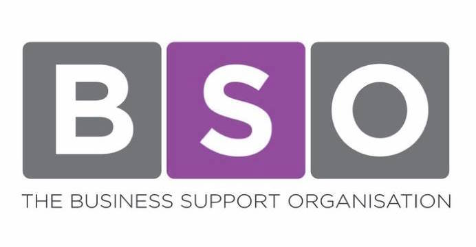
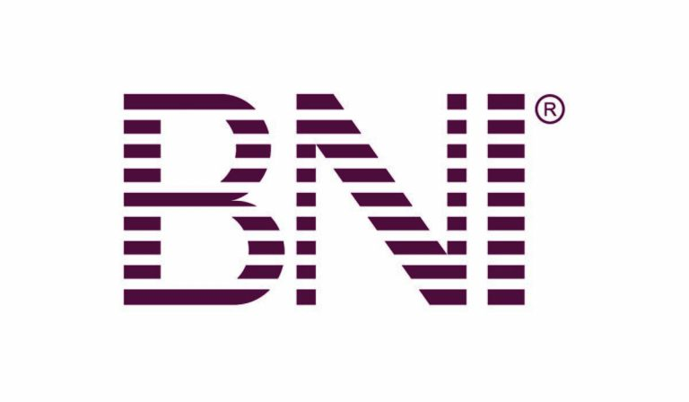

+++
title = "Type of Business Network & Parity"
description = ""
date = "2019-08-02"
categories = ["Networking Events"]
tags = []
author = "Matteo Vanzini"
+++

## Type of Business Network & Parity

Meet people and establish new relationships is important for everyone in business. In Parity we believe that entrepreneurs are stronger, more resilient and better off once they stay together within a network. Our [platform](/about-us) innovates business networking’s idea using technology and delivering personalised and tailored services to the members.

Once you are deciding which network to join, it can be useful to look at the strength of its ties. This doesn't say the value to help you deciding what is best, however it can inform individual entrepreneurs who know and are aware of their own needs and personality. In fact, it's also strong the idea of the strength of weak ties and many business networks have proven its efficacy with more standard networking gatherings. In this blog we will explore few examples of West Midlands practices, from high touch and service focused to lower touch and based on referrals or recommendations.

The first group involves two West Midlands’ business networks characterised by a major feature. Indeed, both these organisations relies on their founders, a “front man” who knows the local business community and can support entrepreneurs providing skills and experiences accumulated over years. These networks are the Business Support Organisation with Brett Sheldon and the Family Business Practice with Peter Roper.

#### Business Support Organisation

The [Business Support Organisation](https://www.thebso.co.uk/) promotes local procurement and supports the West Midlands small business community. Its founder, Brett Sheldon, has worked for more than a decade with small local firms and his experience has shaped BSO operations. Indeed the focus is on each entrepreneur to provide useful skills and knowledge. The BSO is not just about networking. This organisation offers events and a portal to connect with other members, promote your products, or generate leads and find new suppliers. However, this sits alongside a broad range of business support, the “hands-on approach” that BSO prioritises. Indeed as a member you can benefit from legal advice; training courses targeted to small businesses and even an employee engagement programme.

#### Family Business Practice

The [Family Business Practice](https://www.familybusinesspractice.com/) is based on trusted relationships and as “brainchild” of Peter Roper, its founder, it focuses on family run businesses in the Midlands. These firms experience different dynamics compared to the corporate world and having an organisation supporting them helps business operations and family’s well being. Peter Roper - the family business man - can provide you with business news, practical information or relevant articles in this industry. He can support your company’s development by contributing to your strategy with his business growth pathway, a digital platform to deliver blueprints for scalable growth. Eventually, as a member of the Family Business Practice you can also benefit from the audit offer to highlight areas of potential support, and from the business briefing to help you with your marketing strategy.

#### Parity Network

[Parity](/how-it-works) would fit perfectly a middle level, as "moderately touch" network. Parity doesn't offer personal business support such as consultancy or coaching, at the same time brokers relate with members act as external sales force. However, Parity doesn't even offer recurrent events where to promote your business, but at the same time it connects people online facilitate business transactions. Parity offers to its members an innovative way to generate leads and manage your cash flow. Parity is \#digitalnetworking but it's not just a directory because of trusted relationships and it is not just a business network because of the credit line facilitating purchases within the network. In other words Parity is the business network for the 21st century.

The second group includes business networks that rely on a standard formats replicated internationally and mostly based on referrals. Good examples are business breakfasts or the chapters of Business Network International (BNI).

#### Business Network International

[BNI](https://bni.co.uk/en-GB/index) is an american franchise based on local chapters that can be visited by non-members, however without the opportunity to promote their business during this “trial session”. Once you are a member you can join one of the West Midlands chapters and take advantage from it.. In Birmingham BNI is mostly based in the Novotel in Broad Street where three chapters are based: Apollo; Alliance and TGI. Furthermore there is a chapter in the Jewellery Quarter besides the ones in Walsall, Sutton Coldfield; Wolverhampton; Solihull and other locations. Every chapter is different to the others, populated by diverse local businesses and with different network opportunities for you business.

#### Business Breakfast

Business breakfast instead is a format which relies on early bird business people who, before the day actually starts, are happy to share a cup of coffee with other entrepreneurs and talk business. [Business for Breakfast (BforB)](https://www.bforb.co.uk/find-your-nearest-group-2/) also operates in the West Midlands and their breakfasts start from 6.30am to 10am. BforB relies on referrals marketing and most of the business it generates come from personal recommendations and introductions. Another example is the [Business over Breakfast Club](https://www.bobclubs.com/), another international network that bring local entrepreneurs together for breakfast in one of their local clubs. BforB remarks the quality of business generated through referrals and recommendations, although they also offer additional sales and marketing support to facilitate interactions online between members without over-relying on business breakfast.
