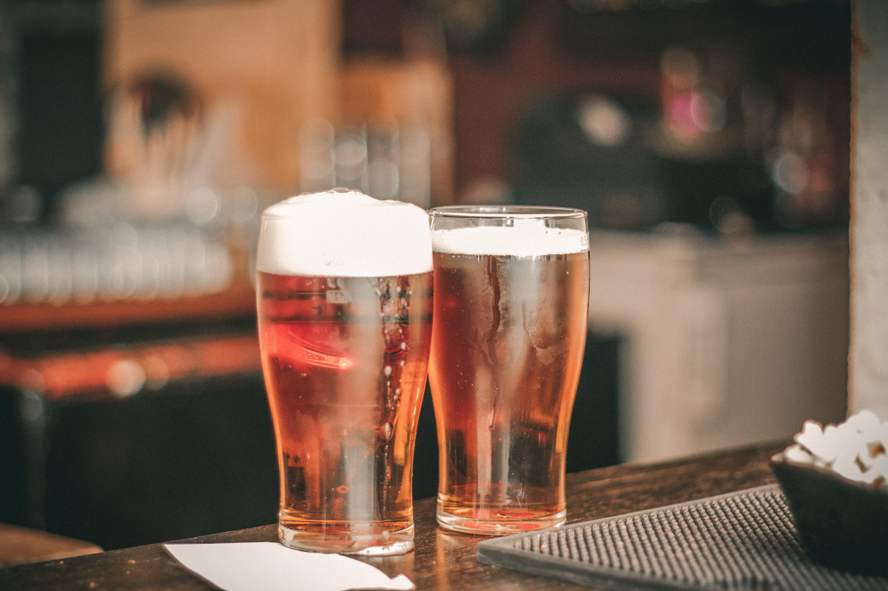
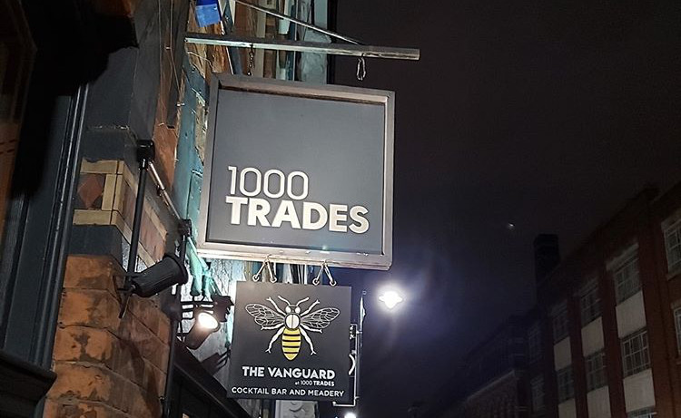

+++
title = "Jewellery Quarter Pubs"
description = ""
date = "2019-10-16"
categories = []
tags = []
author = "Matteo Vanzini"
social_image = "beer2.jpg"
social_image_alt_text = "Picture of three hands holding pints in a pub"
+++

## Jewellery Quarter Pubs

### 8 places to discover in the Jewellery Quarter

Being part of the jewellery Quarter community has been great and we have quickly learnt that the Jewellery Quarter in Birmingham is a vibrant neighbourhood. In the morning people come here to work while In the evening - probably even from the afternoon -, people reach the Jewellery Quarter to enjoy nice food, a pint and, why not, some live music.
Jewellery Quarter pubs offer is wide and here we suggest eight places on the way from our office, in Vyse Street close to the Jewellery Quarter train station, to Saint Paul Square, iconic and important location for this community.

#### Rose Villa Tavern

Speaking about iconic places in the Jewellery Quarter; the first stop has to be the [Rose Villa Tavern](http://therosevillatavern.co.uk). It’s the building staring at the clock caught is many artistic pictures of the Jewellery Quarter. Among the Jewellery Quarter pubs, here it is the place where to come after work, after 5pm, to enjoy some food with a nice cocktail. They serve “happy hour cocktails”, 2 cocktails for £9!

#### The Button Factory

If at the roundabout with Warstone Lane you keep going down to Frederick Street, on your left you should quickly see the [The Button factory](http://thebuttonfactorybirmingham.co.uk/menus). This place is welcoming you from early in the morning until later in the evening and the kitchen offers a broad selection with a menu for every occasion. From breakfast and brunch to lunch and dinner, with also a special offer for your Saturday and Sunday lunch.

#### Ana Rocha Bar &amp; Gallery

Just on the other side of the road you can proceed to the next Jewellery Quarter pub, the [Ana Rocha Bar &amp; Galler](http://anarocha.co.uk). This is a very special place in the Jewellery Quarter. Here you can enjoy some Spanish tapas with a good selection of wine and cocktails. However, the killer feature of Ana Rocha is the art surrounding you. While enjoying your drink you can discover their contemporary art, especially works by the Spanish artist Vera Montalban. Besides pictures, in the bar you can also see antiques and watches exposed. It’s not just exposition but you can buy some if you’d like.

#### Acapella

[Acapella](https://acapellabirmingham.co.uk) is just on Ana Rocha side and it’s a newly opened live music bar in the Jewellery Quarter, Birmingham. With Acoustic, Jazz, Soul &amp; Blues music alongside a nice cocktail, the Acapella is filling a gap in Jewellery Quarter bars. If you love this music you must give it a try! Have a look at their website to see what upcoming events are planned.

#### 1000 Trades

It’s time to cross Frederick Street again for our last stop in this road. You cannot miss the [1000 Trades](http://1000trades.org.uk), a Jewellery Quarter’s gem. The 1000 Trades is an award-winning pub and a good place to enjoy some craft beer. However, the 1000 Trades is way more. The rotating kitchen changes regularly chef and food offer. In partnership with Slow Food, in the 1000 Trades every Monday you can meet local farmers and purchase your local - and slow - food. Then, the second floor at 1000 Trades offers a nice event venue and here are regularly hosted meetups or business and networking events. Opened just in 2016, this place has already become a pillar of Jewellery Quarter Birmingham pubs.

#### 40 St. Pauls

Finishing with Frederick Street, you need to walk a couple of minutes to reach Saint paul Square. Our first stop will be [40 St Pauls](https://www.40stpauls.co.uk). This Jewellery Quarter pub has been awarded “World’s Best Gin Bar 2019” and here you can enjoy 140 different gins. Their gin passion is clear and if you are a gin lover too you can also consider their gin testing. Drink responsible though.

#### The Jam House

The [Jam House](https://thejamhouse.com) is based just on the other side of the square and here the music changes. This Jewellery Quarter pub has a very busy calendar and there are gigs for every taste. If you are a latino dancer, feeling salsa and merengue in your soul, on the last Thursday of the month in the Jam House there is Salsa Night. Go and join other dancers until 1am!

#### Actress and Bishop

Ludgate Hill starts in Saint Paul Square and here it’s where our Jewellery Quarter pubs list ends. If you are planning to use this blog to organise your next pub crawl you must end your journey here. The [Actress and Bishop](http://theactressandbishop.co.uk) normally closes at 2am while in the weekend at 4am. Here, besides good drinks, you can also enjoy some live music with acoustic sessions on Wednesday and good reggae roots every first Sunday of the month.

We hope this list will help you discover some Jewellery Quarter pubs. In the meantime we will keep trying new places in the Jewellery Quarter, Birmingham.
