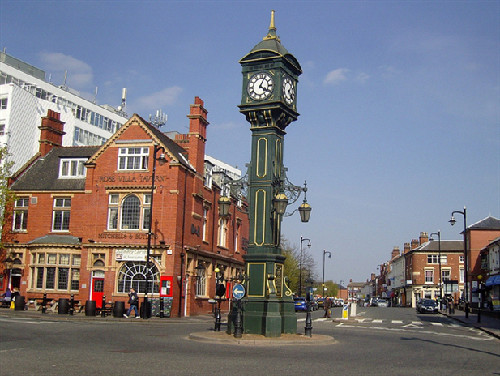
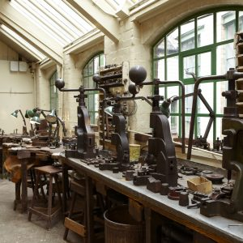
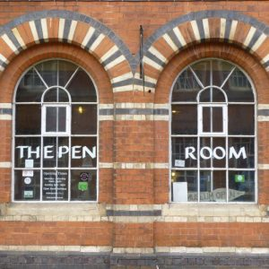
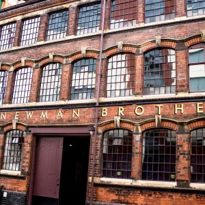

+++
title = "Visiting the Jewellery Quarter"
description = ""
date = "2019-10-25"
categories = []
tags = []
author = "Matteo Vanzini"
+++

  

## Visiting the Jewellery Quarter

The Jewellery Quarter is a historical neighbourhood in the north west of Birmingham city center. In the 18th and 19th century it developed as an international hub for the jewellery industry and still nowadays it produces almost half of the jewellery made in the UK. Nevertheless, in the last decades this area of Birmingham has experienced a change. It has become residential area and home for many local and independent businesses.
Without compromising the identity of this area, the Jewellery Quarter has become also a favourite destination for nightlife. Indeed lots of breweries and pubs are now offering nice food, drinks and live music to relax and enjoy the company in a not too busy environment.
Here our [blog](/posts/2019-10-16_jewellery-quarter-pubs) on eight pubs and bars to visit in the Jewellery Quarter.

For multiple reasons therefore, the Jewellery Quarter is now a must for visitors coming to Birmingham. Following we will introduce three main cultural attractions that cannot be missed.

#### Museum of the jewellery Quarter

Firstly is the [Museum of the Jewellery Quarter](https://www.birminghammuseums.org.uk).
Located in Vyse Street - less than a minute away from our office -, the museum is built within the jewellery workshop of Smith &amp; Pepper jewellery manufacturing firm. When the owners retired in 1981 they decided to just close down their premises and this has left a well preserved example of how this industry looked like in the 20th century. Here tourists can enjoy expositions, watch demonstrations of traditional skills and techniques or enjoy the feeling of being brought back in time.

#### Pen Museum

Secondly, tourists should pay a visit to the [Pen Museum](https://penmuseum.org.uk).
Opened in 2001 thanks to the support of Brian Jones MBE, the Pen Museum is promoting and preserving the important legacy of Birmingham and jewellery Quarter pen industry. Indeed, the industrial revolution facilitated pens mass production and in the 19th century most of the pens used world wide were produced in Birmingham. The museum is based in Frederick Street within a disused pen factory built in 1863. Here visitors of the jewellery Quarter can enjoy a unique collection of pens and tools relevant for the industry distributed within three galleries. The Pen Museum is a registered charity and relies on the work of volunteers who support the community and share the passion and interest on pen of the founders.
For this [donations](https://penmuseum.org.uk/support/donate) are crucial and on the website you can find how to contribute.

#### Coffin Works

 

Third attraction in the JQ is the [Newman Brothers at Coffin Works](http://www.coffinworks.org).
Similar to Smith &amp; Pepper, also this coffin-furniture factory was closed and left untouched after the last day of work in 1998. The Newman Brothers opened in 1882 and the museum shows more than 100 years of this manufacturing factory. Tools and machineries are exposed here to fully experience employees daily operations and to feel how to work there looked like. The guided tour lasts for about one hour and it’s worthy to spare this little time while visiting the Jewellery Quarter.
