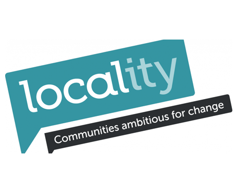

+++

title = "Why is Parity a tool for Local Economic Resilience?"
description = "Learning for the experience of WIR and Sardex"
date = "2020-01-10"
categories = ["Business Development","Company News"]
tags = []
author = "Matteo Vanzini"

+++

## Why is Parity a tool for Local Economic Resilience?

A currency designed to support independent businesses and boost the local economy is not a complete novelty mainly because of
the long standing experience of the [WIR Bank](https://www.wir.ch) in Switzerland. Established in 1934 by Zurich’s entrepreneurs, WIR was conceived
to address the lack of liquidity and credit crunch in years of economic depression.

The financial instability after 1929 made credit unavailable or very expensive, uncertainty reduced the overall consumption
resulting in revenue losses; nevertheless the capacity of local businesses to produce and sell had not changed. A group of
local entrepreneurs was keen to find the solution to keep trading one to another and that’s when they started to buy and sell
not in Swiss Francs, but instead using a system of interest free credit called WIR.

The economic model was based on Silvio Gesell’s theory and became very popular when J.M. Keynes applied it within its proposal
to Bretton Woods advocating for a complementary currency called ‘Bancor’ to manage international trade surplus and deficits.

'It is convenient to mention at this point the strange, unduly neglected prophet Silvio Gesell (1862-1930)'
--<cite>John Maynard Keynes (1936) General Theory of Employment, Money and Interest. Book VI, Chapter 23:
Notes on mercantilism, the usury law, stamped money and theories of under-consumption.</cite>

However, despite its fame in the first half of the 20th century the success was not consolidated. For many years indeed
practitioners have tried to replicate the model in different localities and communities but without ever reach the same
extent of WIR in Switzerland.

WIR seemed to have a secret ingredient for success until [Sardex](https://sardex.net) was developed and quickly became a
[global best practice](https://www.ft.com/content/cf875d9a-5be6-11e5-a28b-50226830d644). Sardex was established in 2010 in
Sardinia, Italy, right after the financial crisis and taking advantage of new networking technologies it was able to grow
exponentially ever since then having a great impact on the regional economy.

Despite nowadays technology plays a crucial role in WIR’s operations too, to understand the reasons of these two successful
stories it is more important to focus on  the context in which both have been established.

# Resilience: the ability of people to feel better quickly after something unpleasant, such as shock.

WIR was born as an initiative of a group of entrepreneurs who, to protect their business from the financial collapse,
decided to cooperate within a network of mutual credit meaning that they were able to issue credit one to another within
a currency parallel to the main Swiss Franc. They called the currency WIR and the results were impressive.
WIR helped businesses out during hard times and afterwards it remained a trusted institution for local SMEs; inn 2005 it
counted over 60,000 businesses in its network transacting over 1 billion WIR each year.

The framework behind Sardex birth was not too different. The 2008 crisis hurt the Italian financial system and the Sardinian
economy suffered a considerable GDP decline; consumption decreased, banks were offering very expensive credit and for
small businesses there were little opportunities to stay in the market. For them Sardex represented a blessing; on one hand
it boosted local trade by making it more advantageous while on the other hand it provided short term liquidity without
interest costs and tight deadlines.

# Counter-ciclicality

Researchers (1) have analysed WIR data throughout decades and it has emerged a clear countercyclical nature. When the Swiss
economy struggle and credit is more expensive in the main banking sector, the use of WIR increase. Instead, when the economy
grows the amount of WIR circulating reduces. This has increased the economic resilience of entrepreneurs who are able to mix
different currencies, Wir and Swiss Franc, in their business expenses.

In Sardinia there are not enough data for the same conclusions but we have been in Sardinia conducting over 50 interviews and
there are multiple stories that prove the positive impact Sardex has had on local economic resilience. Thanks to Sardex some
entrepreneurs were able to grow – 15% more turnover – despite recession, others were able to invest and increase productivity
thanks to the extra liquidity and the new income the network provided and, finally, other businesses were able to keep all
the staff thanks to the opportunity to pay their wages partially in Sardex. We heard about a company in which an employee was
about to be fired to reduce the costs and, only because all his colleagues decided to accept part of the wage in Sardex, the
entrepreneur was able to keep him employed.

Both experiences are inspirational for Parity and have shown how, in time of uncertainty and financial instability, a local
currency for businesses can be a tool for economic resilience. It supports the real economy, the one of goods and services
exchanged, and unleashes the potential of independent businesses to produce and sell. It is a way to monetise spare capacity
within a business network made of trusted relationships and based on values as cooperation and reciprocity.

(1) James Stodder (2008) Complementary credit networks and macroeconomic stability: Switzerland’s Wirtschaftsring.
Journal of Economic Behavior & Organization 72 (2009) 79–95
