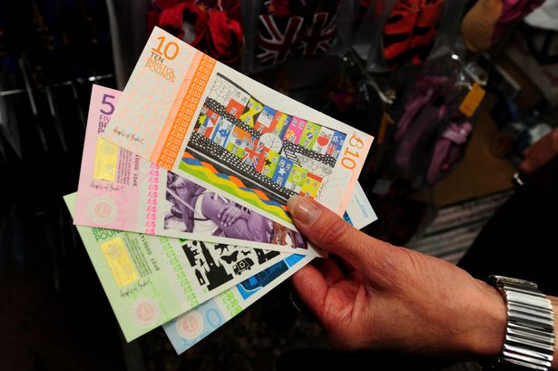

+++
title = "How does Parity compare with Bristol Pound?"
description = "Comparison between Parity and Bristol Pound"
date = "2020-01-23"
categories = ["Business Development","Industry News"]
tags = []
author = "Stuart Bowles"
# 1200x630 pixels and an aspect ratio of 1.91:1, less than 1MB otherwise will be rejected
social_image = "Bristol-Pound-notes.jpg"
social_image_alt_text = "Bristol Pound Notes"

+++

## How does Parity compare with Bristol Pound?

We have been on a long journey of development to get to where we are today. I have personally been interested in alternative currencies for a while now. I have studied a wide range of models, from the famous [Bitcoin](https://bitcoin.org/en/bitcoin-paper), to Sardex, which is our main inspiration. The largest local currency in the UK is the Bristol Pound. I thought I would share some thoughts on how we differ from the UK’s leading local currency project.

Bristol Pound was formed in 2013 as part of the city’s attempt to win the European Green Capital Award. It wasn’t the first local pound, that title goes to Totnes Pound, which alongside Brixton and Stroud, formed the first hyper-local currencies. Bristol Pound used the momentum from these other local currency projects to set out an ambitious plan to develop a city-wide currency. They engaged local businesses and the city council to raise awareness about the benefits that a local pound could bring to Bristol. They received a huge amount of support, with Bristol City Council agreeing that business rates could be paid in the currency, and then city mayor agreeing to have his wage paid in the currency. Bristol Pound grew a network of over 800 businesses across the city that were willing to accept the currency. There were thousands of residents who started using the currency for daily purchases. They gained a significant amount of national and international attention.

When I have been engaging with companies in Birmingham, a couple have asked me about how we compare to the Bristol Pound. So I thought I’d outline the main differences:

Firstly, we have a different local currency model to the Bristol Pound (B£1). Before using Bristol Pound, you are required to buy them at a rate of £1 = B£1. You can then take your Bristol Pounds into local shops and purchase goods with them. If the business owner doesn’t want to use them, they can then convert back to normal pounds. To use Parity, you don’t need to purchase the local currency, you use a 0% interest credit facility. Our local currency (PRX) is also equal to pounds, but you can’t convert them. When businesses receive PRX, we ensure that they can purchase their own supplies and expenses with the currency. The benefit of this is that we are providing additional spending power to businesses, which is not the case in the Bristol Pound.

Secondly, the main target audience for Bristol Pounds is consumers. It is largely for residents and visitors to Bristol to convert their pounds and spend them in local, independent shops. They have been working to develop their business-to-business network, to help create supply chains for the businesses in the currency. Parity does not have a consumer offer, although business owners can use our currency for their own personal expenses. So we do foresee bringing on similar businesses as Bristol Pound, such as cafes, hairdressers and personal services. The main focus for Parity is business-to-business, and the companies that we currently have on our network are mainly these.

Thirdly, there are some minor differences around what the currency itself looks like. Bristol Pound started as a paper currency and then introduced a text payment option. I do believe that they have since developed a smartphone app that allows you to search for businesses, and I think make payments. Parity is completely digital. We have an application available for Apple and Android, alongside a desktop application that can be accessed through our website. Parity cannot have a physical paper currency, as it is based on credit. Although we do realise that the paper currencies is something that often excites individuals about local currencies.

Finally, the availability of business credit is different between Bristol Pound and Parity. As mentioned above, Bristol Pound has to be bought, although they are now experimenting with a business lending option, where companies can get loans through Bristol Pound. Parity is entirely based on credit. Every company has access to a 0% credit facility for purchases, providing them with an additional source of liquidity and helping cashflow.

These are the main differences between Bristol Pound and Parity. We do like to follow their development and have attended events they have organised over the past couple of years. We will also keep an eye on developments within our sector, including the city applications built by Colu that have been trialled in Liverpool and East London.
