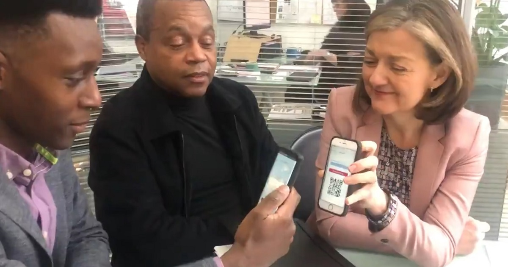

+++
title = "Parity supports four local firms to transact without cash"
description = "Businesses used Parity local currency to transact"
date = "2020-02-06"
categories = ["Business Development"]
tags = []
author = "Stuart Bowles"
draft = false
# 1200x630 pixels and an aspect ratio of 1.91:1, less than 1MB otherwise will be rejected
social_image = "parity-four-local-firms.jpg"
social_image_alt_text = "Picture with Parity brochure, flyer and a mobile phone showing Parity's app"
+++

## Parity supports four local firms to transact without cash

### This week four businesses have used Parity to conduct transactions within our local currency.

Parity is a B2B platform in Birmingham that has its own local currency. This week some of its members have had the first chance to really appreciate what Parity can do. It all started on Tuesday when [Repc](https://repcltd.co.uk) and [Kinetic](https://kineticpr.co.uk) conducted their first transaction. It was supported by our broker and digital platform. Kinetic has helped Repc develop a new communications strategy through their [Kickstarter Programme](https://www.kinetickickstarter.co.uk/). Being a Parity member gives Repc the opportunity to purchase marketing support without using pounds. On the other hand, Kinetic has recently joined the network with the aim of increasing local sales and can use this additional Parity income to offset some of their pounds expenses. 

#### _“Being a Parity member gives Repc the opportunity to purchase marketing support without using pounds.”_

The relationship was brokered through Parity who had identified that they both shared a similar set of values. Kinetic is a pioneering firm that has worked on environmental programmes in the past. Repc is a social enterprise that has over 20 years experience delivering environmental projects in the UK and around the world. Both companies were really excited to use our innovative technology. Our mobile application is very intuitive, but because of the novelty of the platform, Parity supported the transaction. Stuart was happy to walk them through our app and once the doubts were cleared, the transaction happened. 

#### _“Both companies were really excited to use our innovative technology.”_

Our local currency moved instantly and with no transaction costs. Repc is now within their zero interest credit line and Kinetic now has spending power to purchase other goods and services from the network. On Thursday it was the turn of [Achut](https://achut.co.uk/) and [Iron House](https://iron-house.co.uk/), two other members to conduct their first transactions. Iron House joined Parity with an urgent need, “I need a removal, asap”. Achut is a commercial waste and removals firm and could meet the needs of Iron House. We brokered the connection and then let them do business. Felix from Achut visited Iron House in the Jewellery Quarter to collect waste and once he finished the job, the transaction was conducted onsite.

In conclusion, this week four local businesses conducted transactions in our local currency. Parity created new liquidity allowing them to transact without the use of cash. Parity believes it can be a great tool for supporting the local economy.
