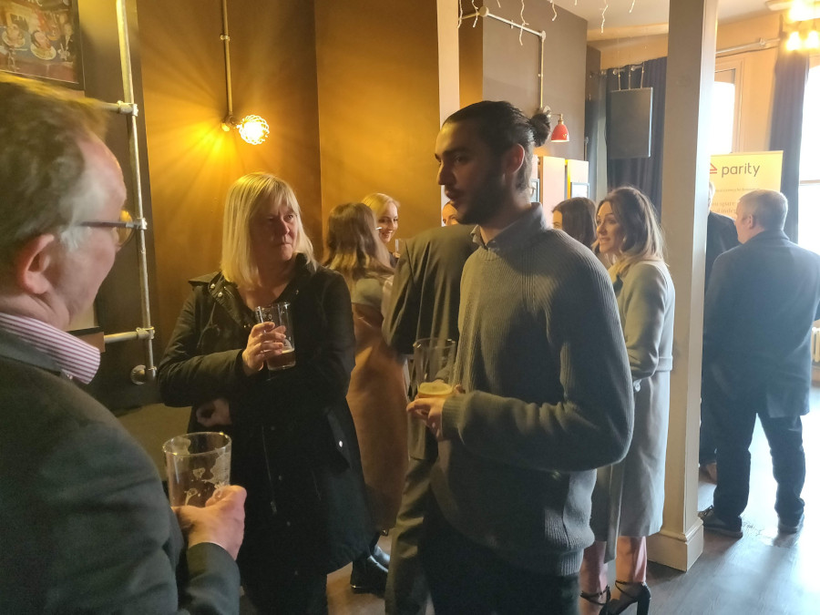

+++
title = "1000 trades networking club"
description = ""
date = "2020-03-13"
categories = ["Networking Events"]
tags = []
author = "Matteo Vanzini"
draft = false
# 1200x630 pixels and an aspect ratio of 1.91:1, less than 1MB otherwise will be rejected
social_image = "1000Trades-Networking-Club.jpeg"
social_image_alt_text = "picture of four persons networking"
+++

## 1000 trades networking club 

On Thursday the 5th March we hosted our first ‘1000 Trades Networking Club’; here are some highlights from the event. 

It was a fantastic turnout and we are very thankful to everyone attending. It’s amazing to see how many businesses enjoy networking and want to trade more locally; that’s the kind of community we aim to build in the Jewellery Quarter.  

#### _"business that enjoy networking and want to trade more locally"_

We wish to give credit to 1000 Trades pub who made available the venue and tapped some great craft beers. We are proud to have in the network an award winning independent pub. It really showed how it’s easily integrated into everyday transactions when attendees also on the network bought their beers from 1000 Trades using Parity

For us, this is the clearest way to demonstrate the benefits of Parity. Members used the currency to buy drinks meaning no pounds were used; while for 1000 Trades gained new customers generating extra income to spend later in the network. 

#### _"members used the currency to buy drinks meaning no pounds were used"_

The informal style of networking seemed to be well received, we will keep this format for future events which will be happening on the first Thursday of the month at 1000 Trades from 4.30pm to 6pm. You are invited to come along! 

We want people to connect with like-minded business owners and establish trusted relationships locally.  
