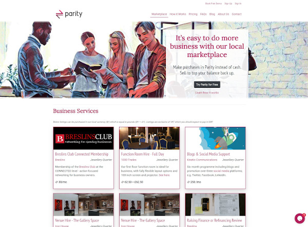

+++
title = "The development of a local marketplace for business-owners in Birmingham to trade without cash"
description = "Parity has been supported with a grant from the Greater Birmingham and Solihull Local Enterprise Partnership (GBSLEP) to develop a beta phase"
date = "2020-07-31"
categories = ["Business Development"]
tags = []
author = "Stuart Bowles"
draft = false
# 1200x628 pixels and an aspect ratio of 1.91:1, less than 1MB otherwise will be rejected
social_image = "marketplace.jpg"
social_image_alt_text = "marketplace view on Parity website"
+++

# The development of a local marketplace for business-owners in Birmingham to trade without cash

## Parity has been supported with a grant from the Greater Birmingham and Solihull Local Enterprise Partnership (GBSLEP)

Parity Network offers business-owners a marketplace to trade without cash. It developed from a research project at the University of Birmingham that studied similar models in Italy and Switzerland. We have spent a significant amount of time adapting the model to meet the needs of businesses in Birmingham. It uses a local currency to allow businesses to make purchases and conduct sales without the need for pound sterling. In January we launched with a small number of businesses in the Jewellery Quarter, who started making business to business transactions within the local currency. Parity provided businesses a way of meeting new clients, receiving an additional income and making purchases within local businesses, including an independent pub. In March, our development attracted the attention of the GBSLEP, who saw the potential Parity had to support local businesses, especially as the lockdown was just starting to come into effect. I thought I’d spend a little time explaining how the GBSLEP has supported our development over the last three months.

#### _“Parity provided businesses a way of meeting new clients, receiving an additional income and making purchases…”_ 

GBSLEP provided Parity a grant to help develop our offer and support the development of a beta phase that will aim to attract our first one hundred users. The grant initially paid for market research that was completed by the Birmingham-based consultant Courtney Patrick from Create + Propel. She interviewed current users and non-users to understand how they understood Parity, what were the barriers to uptake and how could they be encouraged to transact using the local currency. Courtney found that users and non-users found it difficult to fully understand the local currency or the benefits of using the model. They were unsure how they promoted themselves through the currency or what was available to purchase. A limitation of Parity was it was more like a business network or directory, where businesses would need to contact one another to find out what was on offer. Non-users were unsure about taking the risk of joining, as they were unsure what was available to buy or what they were committing to the network. The research Courtney conducted was incredibly useful for us to understand the issues currently holding back the scaling of our network.

#### _“They were unsure how they promoted themselves through the currency or what was available to purchase.”_

The market research has allowed us to develop our product. We have now launched an online marketplace where users can post what they are happy to offer in exchange for the local currency. They have the option to post offers 100% in the local currency, or for their more expensive services: 50% in the local currency and 50% in pound sterling. Income in the local currency can then be spent in the marketplace, and they have some pound sterling to cover costs. Our users have been posting a mixture of offers, from promotions to their entry level services. This allows them to do some work in Parity and develop new long lasting relationships with clients. The new marketplace has also attracted positive attention from independent retailers, pubs and restaurants. They are now able to post offers and promotions to increase foot fall to their premises. Over the coming weeks we are going to finish filling the marketplace with the offers from our current members, and start onboarding new businesses that have signed up.

The grant support from the GBSLEP has allowed us to fully understand how local businesses want to use Parity. The changes have resulted in the development of a local marketplace of products and services business-owners can purchase without cash. In this time of coronavirus-induced economic issues, cash is king, and Parity offers businesses a way of trading without cash. We are excited about our developments and over the coming weeks will be implementing our new marketing strategy. Thanks for reading.
