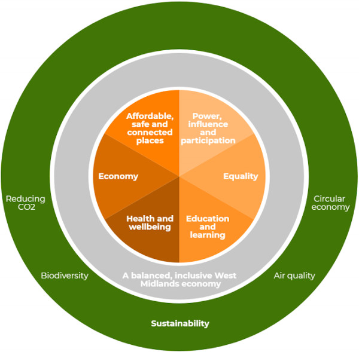

+++
title = "Inclusive Economy"
description = "This blog looks at inclusive economy and explores impact and opportunities for Birmingham and the West Midlands"
date = "2020-09-17"
categories = ["Regional News"]
tags = []
author = "Matteo Vanzini"
draft = false
# 1200x628 pixels and an aspect ratio of 1.91:1, less than 1MB otherwise will be rejected
social_image = "WMCA.jpg"
social_image_alt_text = "Doughnut economics model used to by the West Midlands Combined Authority"
+++

## Inclusive Economy

The debate around what a ‘good change’ would look like for the economy has recently intensified. The coronavirus pandemic and the Black Lives Matter movement have both raised issues to which [#BuildBackBetter](https://www.buildbackbetteruk.org/) and the [Black Pound](https://blackpoundday.uk/) have proactively responded. Their positive and solution orientated approach cannot be ignored; Parity would like to support their effort in our locally community for a fairer and more sustainable change.

In this blog we will focus on inclusive economy - What is it? What’s already happening? And what can we do to support it? We’ll consider its impact on the local business community and we’ll deepen three dimensions of inclusive economic growth: infrastructure, human capital and finance. 

#### What is an Inclusive Economy?

The [definitions](https://blog.bham.ac.uk/cityredi/redi-updates-1-what-is-inclusive-growth/) are multiple and diverse; what we know is that [economic inclusion](https://www.centerforeconomicinclusion.org/benefits-of-inclusive-growth) is a proven driver of *prosperity*. An inclusive economy allows every individual to participate in the market as entrepreneurs, workers and consumers, and creates opportunities to advance in career and invest in the future. It relies on public-private cooperation to build an ecosystem that drives economic growth through innovation and business creation.

#### What’s already happening? 

Birmingham and the West Midlands have embraced the inclusivity challenge with the following initiatives:

***Infrastructure***

The West Midlands Combined Authority (WMCA) is investing heavily in [improving infrastructure](https://www.wmca.org.uk/media/2230/infrastructure.pdf) to make sure economic prosperity is distributed across society and opportunities are accessible to all. 

> *“connectivity through transport is a great example of how investment can improve communities’ access to opportunity and drive economic growth”* [Andy Street](https://blog.bham.ac.uk/cityredi/redi-updates-interview-andy-street-the-west-midlands-mayor-on-inclusive-growth/), WMCA mayor, July 2020.

Infrastructure is a key element for regional development, SMEs competitiveness and inclusion. These investments are overseen by the [WMCA Inclusive Growth Unit](https://www.wmca.org.uk/what-we-do/public-service-reform/inclusive-growth-unit/) which makes sure the implications on local communities are taken into consideration and proposals are assessed within the [Inclusive Growth Framework](https://governance.wmca.org.uk/documents/s2060/Report.pdf) - [Doughnut Economics](https://www.kateraworth.com/doughnut/) model from Kate Raworth.

***Human capital***

Birmingham is a young, multicultural city with a vibrant [economic fabric](https://www.birmingham.ac.uk/Documents/college-social-sciences/business/research/city-redi/Databooks/west-midlands-databook-2019.pdf). Entrepreneurial skills and business support are keys to success and recent projects at Aston Business School aimed to be more supportive of inclusive growth.

[BSEEN](https://b-seen.biz/) (Birmingham Skills for Enterprise and Employability Network) offers students and graduates a great package of intensive start-up support. The [Aston Programme for Small Business Growth](https://www2.aston.ac.uk/aston-business-school/business/centre-for-growth/aston-programme-for-small-business-growth) aims to support SMEs growth and employment in the region. [CREME](https://www2.aston.ac.uk/aston-business-school/research/research-centres/CREME) (Centre for Research in Ethnic Minority Entrepreneurship) offers leading expertise on business support for ethnic minority entrepreneurs, and it’s currently involved in the following projects: [The Business Leaders Project](https://vimeo.com/254118123); [Productivity from Below](https://www.enterpriseresearch.ac.uk/productivity-addressing-productivity-challenges-microbusinesses/): Addressing the Productivity Challenges of Microbusinesses and [The Diverse Supply Chain](https://diversesupplychains.co.uk/).

***Finance***

Researchers identify the lack of affordable credit available to SMEs at levels of £0-£150,000 and remark the [regional imbalance](https://www.accountingweb.co.uk/community/industry-insights/whats-driving-the-regional-imbalance-in-uk-sme-funding) in UK SME funding, besides the [struggle](https://www.ft.com/content/4f7ab34c-5a70-4cae-b04d-1c90ed1a230e) for certain demographics e.g. black entrepreneurs to access finance and find investors. 

Despite conventional [Community Development Finance Institutions](https://www.bba.org.uk/customers/business-banking/financial-support/community-development-finance-institutions-cdfis/) (CDFI) e.g. [ART Business Loans](https://artbusinessloans.co.uk/) or new fin-tech solutions such as [GFA Exchange](https://www.gfaexchange.com/), SMEs based in the West Midlands need more to access financial products more easily. Accessibility and inclusion are crucial for Parity and our goal has always been to help micro and small business through financial innovation. [Our solution](https://parity.uk/how-it-works/) is designed to be complementary and not exclusive, an extra tool local entrepreneurs can add to their existing financial toolkit. 

#### What can we do? 

Given this regional context, Birmingham can become a leading example of inclusion - a place where economic prosperity is accessible and growth is driven by diversity and pluralism. 

The Black Pound Day has offered a great example on how to move forward. It has created an opportunity for every individual to act and make a difference. Now it’s time for institutions, agencies and businesses to do the same and come together for a more inclusive economy. 

At Parity we would love to be part of this ecosystem and are happy to listen to your suggestions. We believe in cooperation, inclusion and mutualism and are willing to support any initiative that based on these values will help local communities to thrive. 
