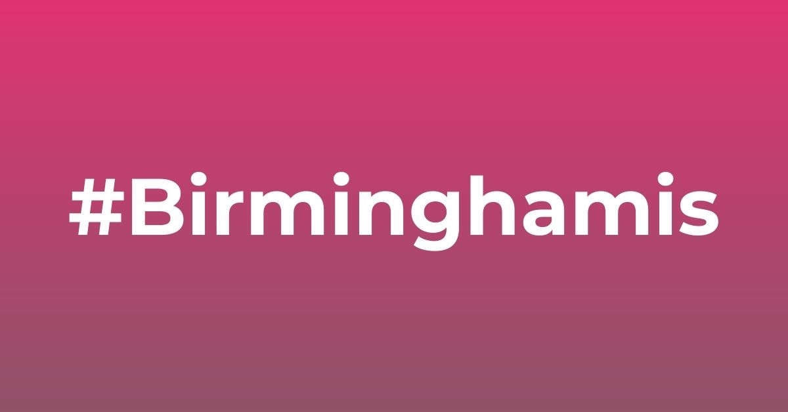
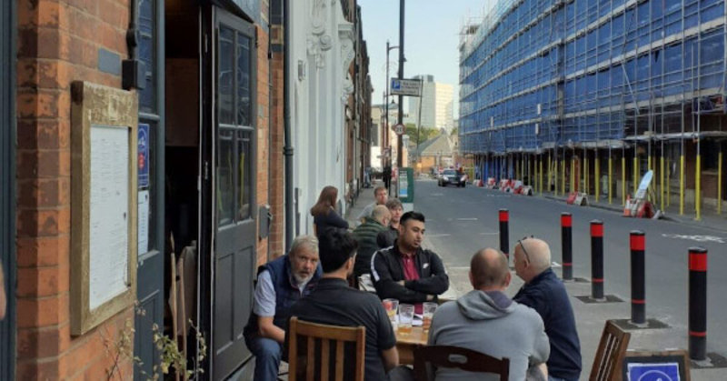
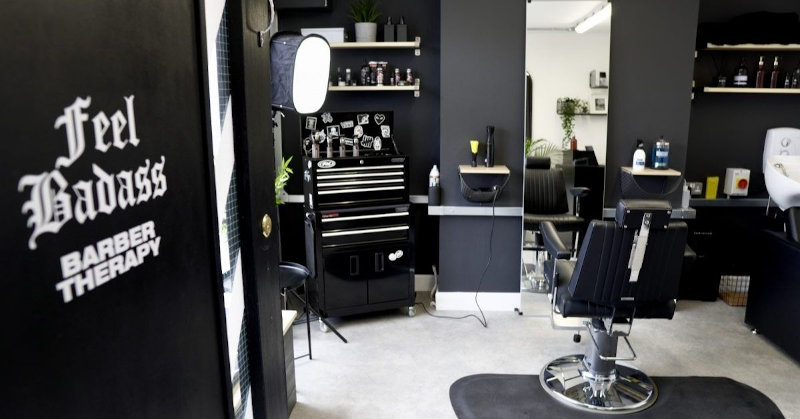
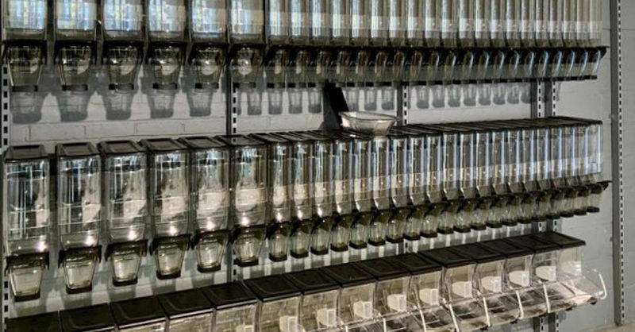

+++
title = "Shining a light on the ‘superstar’ businesses in the Jewellery Quarter"
description = "The concept behind the #Birminghamis campaign is to shine a spotlight on independent businesses in the area, and give them a chance to showcase how they have adapted during these unprecedented times."
date = "2020-11-02"
categories = ["Company News"]
tags = []
author = "Matteo Vanzini"
draft = false
# 1200x628 pixels and an aspect ratio of 1.91:1, less than 1MB otherwise will be rejected
social_image = "#birminghamis.jpg"
social_image_alt_text = "#Birminghamis"
+++

## Shining a light on the ‘superstar’ businesses in the Jewellery Quarter

[The Jewellery Quarter](https://www.birmingham-jewellery-quarter.net/) is famous for many things.

With a history spanning over 250 years, for a small industry hub, it’s inspired poets, been involved in the creation of the Queen’s birthday honours medals and even been the set of many a television show over the years.

But for locals and visitors alike, the Jewellery Quarter is more often than not a place where people revisit time and time again to explore the local, independent shops that reside there.

From coffee shops, beauty salons, and, of course, jewellery shops, the Jewellery Quarter is home to a range of wonderful independent retailers and businesses.

Some of these businesses have been a part of the rich history of the area for many years, whilst other newer residents breathe new life to the location, making it a hotspot for visitors; old and new.

But, back in March 2020, when the Coronavirus pandemic took hold across the world, these Jewellery Quarter residents found themselves having to adapt quickly, and unexpectedly, to keep their livelihoods up and running.

With the pandemic continuing to dramatically impact business operations, even post-lockdown, it’s now more important than ever to ensure the heart of Birmingham keeps on beating.

To help towards the rebuilding of the local economy, the team at [Parity](https://parity.uk), along with the support of other initiatives such as the [JQ Card](https://www.birmingham-jewellery-quarter.net/jq-sales/), are bringing the positivity by sharing their #BirminghamIs success stories.

These stories are from local independent businesses who have stepped up during this unprecedented period, showing the resilience of residents to ensure the area can get back to its former glory, pre-lockdown.

#### [1000 Trades](https://www.birmingham-jewellery-quarter.net/listing/1000-trades/)

The neighbourhood bar and kitchen is located within one of the many listed buildings in the Jewellery Quarter.

Located on Frederick Street, the 1000 Trades was ahead of the game upon the original easing of the lockdown restrictions. 

The team worked with Birmingham City Council to introduce outside seating around the area. This allowed the team to be able to offer social-distanced dining tables outdoors during the summer months, meaning they could cater to a higher number of people at one of their peak periods of the year.

#### Barber Therapy

Hairdressers and barbers have to be face to face with their clients to offer their services.
 
So, when the new social distancing measures were put in place during the pandemic, the sector was in danger of not being able to get back up and running as quickly as others.
 
But, Barber Therapy, located on Spencer Street, was quick to reassure customers that the business was covid-safe, to ensure they could get back to doing what they love best.
 
They were able to offer a completely secure and safe environment for customers, allowing them to experience a personalised, one-on-one hair appointment, to help them relax and forget the worries of the real world for just a few moments.
 
The team also developed their own online booking system, to ensure appointments were scheduled to the minute, to make sure there were no crossovers where face-to-face contact was necessary.

#### Roots Market

A new business to the Jewellery Quarter, post-lockdown, is the Roots Market.
 
With eco-friendly living still high on the agenda, even following the pandemic, the Roots Market is an independent supermarket offering locally-sourced seasonal and organic food, ready meals and cook-at-home recipe boxes, made by the team.
 
The Roots Market team is dedicated to removing unnecessary packaging for its goods, with an aim to be completely plastic-free by 2025.
 
With a new era of shopping now more important than ever, the introduction of the Roots Market to the Jewellery Quarter will be a much-welcomed concept to the area.

#### _"With the help of such initiatives, residents are being encouraged to spend and shop safely in the area."_

With the help of such initiatives, including [Parity’s local currency](https://parity.uk/marketplace/) and the [JQ Card’s](https://www.birmingham-jewellery-quarter.net/) access to discounted goods and services from Jewellery Quarter businesses, residents are being encouraged to spend and shop safely in the area.

Parity’s local marketplace allows business owners to trade without cash, boosting local spending power and initiating new connections with businesses across the area.
 
Currently being utilised by 22 local businesses, the scheme has facilitated £1000s worth of local transactions, which is why, in this current time, the support is needed more than ever.
 
The [JQ Card](https://www.birmingham-jewellery-quarter.net/) was developed many years ago to incentivise residents and visitors to shop and support the locally-run businesses in the Jewellery Quarter.
 
In total, over fifty local retailers now offer discounts for JQ Card holders, and the card is still a big hit today.
 
The discount the card offers becomes an incentive to visitors who too may be struggling financially, therefore making it a support network that we hope will continue once this difficult period is behind us.
 
And to further support businesses in the Jewellery Quarter, the #BirminghamIs campaign has been launched to share these stories far and wide.
 
The concept behind the initiative is to shine a spotlight on independent businesses in the area, and give them a chance to showcase how they have adapted during these unprecedented times.
 
It’s a focus on the future, and how, with a community spirit, we can welcome back residents and visitors safely and securely.
 
If you’d like to be a part of Parity’s #BirminghamIs campaign and share your story with the team, Parity is on hand to arrange a video interview to help bring your business to the forefront.
 
To find out more information about how to purchase a JQ Card, please visit [www.birmingham-jewellery-quarter.net](www.birmingham-jewellery-quarter.net) or to contact the Parity team, please email them at contact@parity.uk.

