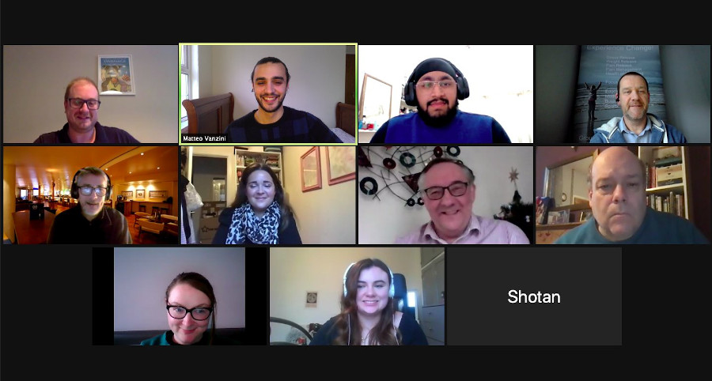

+++
title = "A Local Business Community in Parity"
description = "Some thoughts about the virtual networking event we hosted last week."
date = "2020-12-09"
categories = ["Company News"]
tags = []
author = "Matteo Vanzini"
draft = false
# 1200x628 pixels and an aspect ratio of 1.91:1, less than 1MB otherwise will be rejected
social_image = "zoom-call.jpg"
social_image_alt_text = "Screenshot of the Zoom call showing people attending"
+++

## A local business community in Parity

### Some thoughts about the virtual networking event we hosted last week.

For months we’ve been focusing on raising awareness about the project, reaching out to the local business community and expanding our network so that more products would be available in our [marketplace](https://parity.uk/marketplace/). However, we almost forgot our greatest asset is Parity's existing network - over 20 local business-owners who trust and support each other. We wanted to strengthen these relationships and facilitate more trade so that Parity can have a positive impact on each one of them. A virtual networking event was a good step in that direction.

#### _“Strengthen personal relationships, trust and the sense of community that is so important for Parity to work”_

Until now Parity has acted both as a platform and intermediate among businesses. We edit marketplace listings, promote the products available and connect businesses through what we call ‘brokering’. In order to address the limitations of this approach, Max is now developing our technology to give members control over their listings and make sure they can easily reach out to other businesses in the network. This will strengthen personal relationships, trust and the sense of community that is so important for Parity to work. Our networking events want to do just that too. The easy format allows business-owners to meet personally, introduce their business and have some fun to reduce excessive formality.

#### _“Those who joined our Zoom call wanted to meet fellow members, find out what’s available in Parity and feel part of a network of people”_

Feedback on this event was very positive. Those who joined our Zoom call wanted to meet fellow members, find out what’s available in Parity and feel part of a network of people, not just businesses. They were happy to say we met their expectations. We were pleased to be joined by our two veterans [Brelsins](https://parity.uk/directory/breslins) and [Repc](https://parity.uk/directory/repc/) who were the ones completing the very first transaction in Parity without using cash. At the beginning of the event we took some time to introduce our newest [members](https://parity.uk/directory/) so that attendees could check their marketplace listings and get in touch if interested. It was also amazing to see trade being generated during the event! Phil Beardmore, energy advisor at [Energy Confidence](https://parity.uk/directory/energy-confidence/), is running a [webinar](https://energyconfidence.co.uk/webinar/) on the Green Grant Scheme which is available for 5 Parity. Many of the attendees wanted to find out more and Becki from [Green Fingers](https://parity.uk/directory/greenfingers/) decided to use their interest-free overdraft available and purchase a ticket. Credit to Phil who is also giving all proceeds from his webinar to [Anawim](https://anawim.co.uk/), Birmingham’s Centre for Women.

#### _“If you trade without using cash, trust is all it matters.”

We cannot be happier about the event and we are already working on the next one. As someone said - We look forward to going back to the pub to networking as soon as the pandemic will allow us to do so, but for now it will be virtual. Main takeaway message is that Parity events are nothing like any other business networking. It’s not about pitching your business and it’s not about referrals, people are part of a community and attend to build trust because, if you trade without using cash, trust is all it matters.
