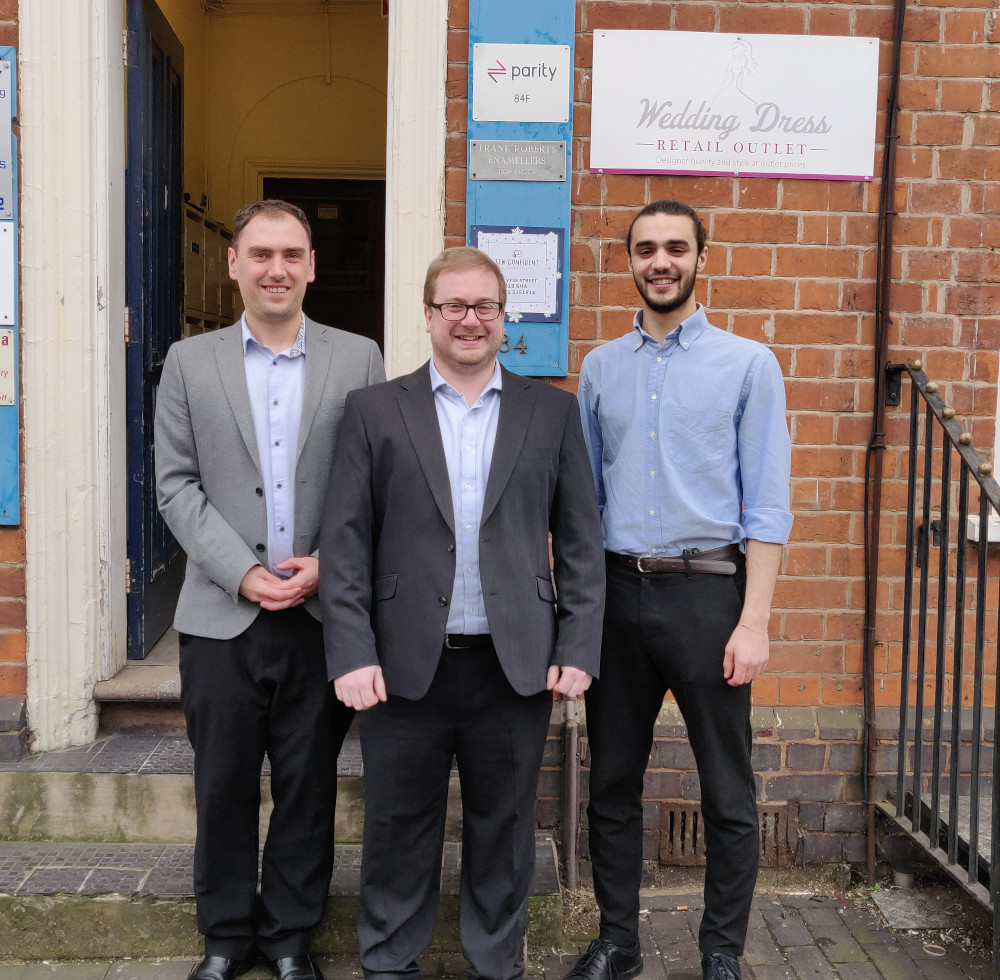

+++
title = "Parity Network is closing its local currency"
description = ""
date = "2021-01-21"
categories = ["Business Development"]
tags = []
author = "Stuart Bowles"
draft = false
social_image = "group_photo.jpg"
social_image_alt_text = "Parity Team"
+++

+++

## Parity Network is closing its local currency

Over the past three years we have been working on developing an innovative digital currency targeted towards small businesses within Birmingham. The model was inspired by the successes of Sardex, Italy and WIR, Switzerland, where 10,000s of small businesses conduct £100millions-worth of transactions each year. It differed from the more popular cryptocurrencies as it allowed its users to access the currency through spending a zero interest credit facility, instead of buying it like with Bitcoin. We believed that the use of a zero interest credit facility within the digital currency would support the cashflow of small businesses in Birmingham, a group that is often underrepresented by the financial system. We are sad to say that as of 25th January 2021 we have decided to cease the operations of our digital currency.

Our reasoning for this decision largely focuses on the traction that we were able to obtain among businesses in Birmingham. Although we managed to attract 25 businesses to our model by the end of 2020, our initial business plan was to be at 125 businesses at this stage. Although the covid-19 outbreak has not been helpful, we did struggle to convince enough business-owners about the benefits of participating within our digital currency. Although we engaged with thousands of local businesses within Birmingham, we found that a fraction of 1% were convinced by this alternative way of conducting transactions. Through undertaking this journey we have acquired a wide set of generic skills associated with running a small business. We have also helped the development of another digital currency in Wales called the Celyn, that we hope will be more successful than ourselves.

We do have some insights that we believe will be useful for other projects developing a similar model of digital currency. Firstly, we believe that there may be a greater chance of success if it is launched within a smaller geographical location, like a town. Birmingham was too big for businesses to form a coherent community, especially once lockdown had stopped the ability to organise networking events. If businesses were located nearby and already had existing friendships or relationships, we believe that this would maximise the chances of success. Secondly, there needs to be a greater focus on referrals to convince new people to join the digital currency. We largely relied on taking the offer to new businesses, whereas encouraging users to refer connections may be a better route for scaling. Thirdly, we can’t understate how important building and brokering connections are. We naively believed that the use of digital marketplace may encourage users to organise their own transactions, whereas we should have played a much more active role. There should also be an emphasis on users buying, as we felt that many users only wanted to sell through our digital currency. Finally, we believe that the digital currency should charge something, even a nominal amount, at an earlier stage. We decided to offer businesses for free to maximise the chance they would join, however we think this resulted in a lower level of engagement. 

We feel sad that we have taken this decision, but we do not have infinite resources to carry on the model until we achieve critical mass. We are now focusing our efforts to adapt our digital platform and mobile application to develop a product that more traditional business networks can use to increase productivity and engagement. We have learnt a huge amount about how small businesses participate within business networks and we do believe the digital currency approach has provided us an unusual insight and opportunity. We have been asked if one day we’ll consider relaunching a digital currency, which could be an option offered to existing business networks and communities. Until then hope to work with traditional business networks to help us develop our new product and maximise the chances of its success. Thanks for supporting and following our development over the last three years and we hope we’ll see you again in the future.

Parity Team
